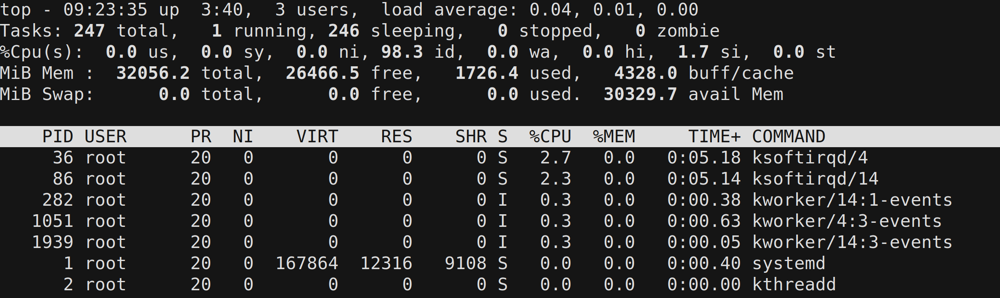
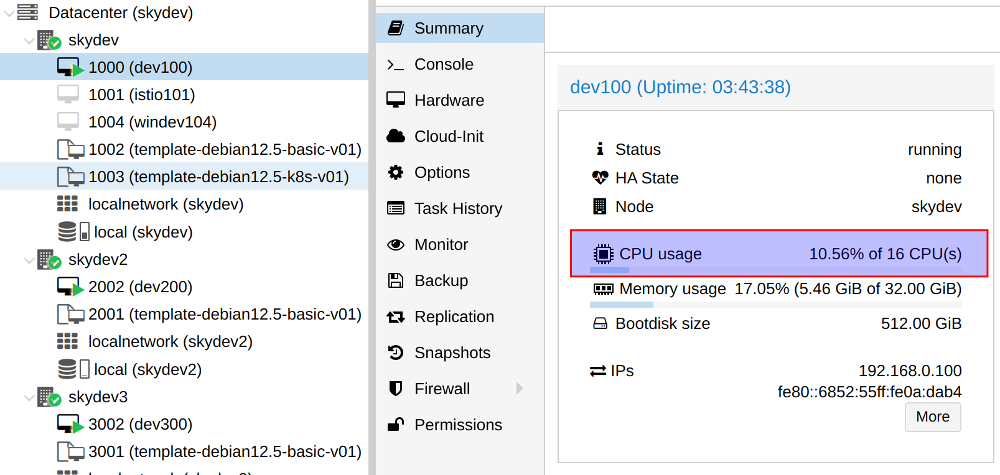

## 准备工作

安装好网卡驱动，如 cx3 / cx4 / cx5 的驱动。

## 搭建软交换

### 新建 linux bridge

安装 bridge 工具包：

```bash
sudo apt install bridge-utils -y
```

查看当前网卡情况：

```bash
$ ip addr

2: enp6s18: <BROADCAST,MULTICAST,UP,LOWER_UP> mtu 1500 qdisc fq_codel state UP group default qlen 1000
    link/ether bc:24:11:97:c4:00 brd ff:ff:ff:ff:ff:ff
    inet 192.168.20.25/24 brd 192.168.20.255 scope global enp6s18
3: enp1s0f0np0: <BROADCAST,MULTICAST> mtu 1500 qdisc noop state DOWN group default qlen 1000
    link/ether b8:ce:f6:0b:ff:7c brd ff:ff:ff:ff:ff:ff
4: enp1s0f1np1: <BROADCAST,MULTICAST> mtu 1500 qdisc noop state DOWN group default qlen 1000
    link/ether b8:ce:f6:0b:ff:7d brd ff:ff:ff:ff:ff:ff
```

enp6s18 是对外的网卡（wan），enp1s0f0np0 和 enp1s0f1np1 准备用来连接其他机器（lan）。

修改 network interfaces，删除所有和 enp6s18 / 是对外的网卡（wan），enp1s0f0np0 / enp1s0f1np1 有关的内容：

```bash
sudo vi /etc/network/interfaces
```

最后保留的内容应该非常少，类似于:

```bash
source /etc/network/interfaces.d/*

# The loopback network interface
auto lo
iface lo inet loopback
```

然后新建一个 br0 文件来创建网桥：

```bash
sudo vi /etc/network/interfaces.d/br0
```

内容为：

```bash
auto br0
iface br0 inet static
	address 192.168.20.2
	broadcast 192.168.20.255
	netmask 255.255.255.0
	gateway 192.168.20.1
	bridge_ports enp6s18 enp1s0f0np0 enp1s0f1np1
	bridge_stp off  
  bridge_waitport 0  
  bridge_fd 0  
```

注意这里要把所有需要加入网桥的网卡都列举在 bridge_ports 中（包括 wan 和 lan, 会自动识别） 保存后重启网络:

```bash
sudo systemctl restart networking
```

或者直接重启机器。（如果之前有配置wan口网卡的ip地址，并且新网桥的ip地址和wan的ip地址一致，就必须重启机器而不是重启网路。）

查看改动之后的网络:

```bash
$ ip addr
1: lo: <LOOPBACK,UP,LOWER_UP> mtu 65536 qdisc noqueue state UNKNOWN group default qlen 1000
    link/loopback 00:00:00:00:00:00 brd 00:00:00:00:00:00
    inet 127.0.0.1/8 scope host lo
       valid_lft forever preferred_lft forever
2: enp6s18: <BROADCAST,MULTICAST,UP,LOWER_UP> mtu 1500 qdisc fq_codel master br0 state UP group default qlen 1000
    link/ether bc:24:11:97:c4:00 brd ff:ff:ff:ff:ff:ff
3: enp1s0f0np0: <BROADCAST,MULTICAST> mtu 1500 qdisc noop state DOWN group default qlen 1000
    link/ether b8:ce:f6:0b:ff:7c brd ff:ff:ff:ff:ff:ff
4: enp1s0f1np1: <BROADCAST,MULTICAST> mtu 1500 qdisc noop state DOWN group default qlen 1000
    link/ether b8:ce:f6:0b:ff:7d brd ff:ff:ff:ff:ff:ff
6: br0: <BROADCAST,MULTICAST,UP,LOWER_UP> mtu 1500 qdisc noqueue state UP group default qlen 1000
    link/ether 6e:38:a0:77:09:dc brd ff:ff:ff:ff:ff:ff
    inet 192.168.20.2/24 brd 192.168.20.255 scope global br0
       valid_lft forever preferred_lft forever
```

检查网络是否可以对外/对内访问。如果没有问题，说明第一步成功，网桥创建好了。

```bash
$ brctl show
bridge name	bridge id		STP enabled	interfaces
br0		8000.6e38a07709dc	no		enp1s0f0np0
							enp1s0f1np1
							enp6s18

$ bridge link
2: enp6s18: <BROADCAST,MULTICAST,UP,LOWER_UP> mtu 1500 master br0 state forwarding priority 32 cost 100 
3: enp1s0f0np0: <BROADCAST,MULTICAST,UP,LOWER_UP> mtu 1500 master br0 state forwarding priority 32 cost 1 
3: enp1s0f0np0: <BROADCAST,MULTICAST,UP,LOWER_UP> mtu 1500 master br0 hwmode VEB 
4: enp1s0f1np1: <BROADCAST,MULTICAST,UP,LOWER_UP> mtu 1500 master br0 state forwarding priority 32 cost 1 
4: enp1s0f1np1: <BROADCAST,MULTICAST,UP,LOWER_UP> mtu 1500 master br0 hwmode VEB 
```

网卡另一头接上其他电脑，通过 dhcp 自动获取了IP地址，而且内外可以互通，测度测试也正常。

软交换就这么搭建好了。

### 小结和对比

上面这个方案，比之前在 ubuntu server 用的方案要简单很多，当时也用了 linux bridge，但需要建立子网，安装 dnsmaxq 做 dhcp 服务器端，配置内核转发，还要设置静态路由规则。

这个方案什么都不用做，就需要建立一个最简单的 linux bridge 就可以了。

### 开启内核转发

> 备注： 发现不做这个设置，也可以正常转发。不过还是加上吧。

```bash
sudo vi /etc/sysctl.conf 
```

把这两行注释取消，打开配置：

```bash
net.ipv4.ip_forward=1
net.ipv6.conf.all.forwarding=1
```

让改动生效：

```bash
sudo sysctl --load /etc/sysctl.conf
```

### 设置 MTU

默认 mtu 为 1500，为了最大化发挥网卡的能力，需要修改 mtu 为 9000.

对于机器 B / C，只要执行下面的命令即可:

```bash
sudo ip link set enp6s16np0 mtu 9000
```

对于软交换所在的 A 机器，需要将 linux bridge 和相关的网卡都设置为 mut 9000：

```bash
sudo ip link set dev br0  mtu 9000
sudo ip link set dev enp1s0f0np0  mtu 9000
sudo ip link set dev enp1s0f1np1  mtu 9000
```

这个方式只能临时生效，一旦机器重启就会恢复成默认的 mtu 1500。解决的方法是修改 rc.local 

参考资料：

- https://www.baeldung.com/linux/maximum-transmission-unit-change-size

## 性能测试

### cx3测试

### cx4测试

25g网卡连接速度25g，用 iperf2 测试出来的带宽有23.5g，接近25g的理论值。

> 忘了有没有改 mtu了，下次再测试看看。

### cx5测试

以 cx5 网卡为例，软交换机器 A （ip 为 192.168.0.100）上一块 cx5 双口网卡，另外两台测试机器 B （ip 为 192.168.0.125） / C （ip 为 192.168.0.127） 上一块单口网卡，用 100G dac线材连接。三台机器都安装好 iperf 和 iperf3。

#### iperf2 测试

在软交换机器 A 上启动 iperf 服务器端：

```bash
iperf -s -p 10001
```

在 B/C 两台机器上分别启动 iperf 客户端：

```bash
iperf -c 192.168.0.100 -P 3 -t 10 -p 10001 -i 1
```

测试直连速度： 达到 99.0 Gits/sec, 非常接近 100G 的理论最大值。

> 备注： 如果不设置为 mtu 9000, 采用默认的 mtu 1500,只能达到约 94 G 。

```bash
[SUM] 0.0000-10.0001 sec   115 GBytes  99.0 Gbits/sec
```

测试转发速度： 在其中一台机器 B 上启动 iperf 服务器端，然后从另外一台机器 C 上测试连接机器 B， 速度可以达到 76.9 G，和 100G 理论最大值相比损失还是挺大的。

```bash
iperf -c 192.168.0.125 -P 2 -t 10 -p 10001 -i 1

[SUM] 0.0000-6.9712 sec  62.4 GBytes  76.9 Gbits/sec
```

注意：`-P 2` 也就是启动两个线程，可以测试出最大值，继续增加线程反而会下降。

特别注意的是，网络速度测试时，在软交换机器 A 上，用 top 命令看似乎几乎没有任何性能消耗：



但实际上，在 pve 虚拟机上，显示占用了块两个核心：



可见此时并没有实现我们期待的在进行软交换时启用 rdma 来减少 cpu 消耗的目的。因此，需要继续考虑如何开启 rdma

#### iperf3 测试

类似的，测试出来 iperf3 下软交换的速度大概是 63.9 G：

```bash
$ iperf3 -c 192.168.0.125 -P 2 -t 10 -i 1

......
[ ID] Interval           Transfer     Bitrate         Retr
[  5]   0.00-10.00  sec  37.2 GBytes  31.9 Gbits/sec    0             sender
[  5]   0.00-10.00  sec  37.2 GBytes  31.9 Gbits/sec                  receiver
[  7]   0.00-10.00  sec  37.2 GBytes  31.9 Gbits/sec    0             sender
[  7]   0.00-10.00  sec  37.2 GBytes  31.9 Gbits/sec                  receiver
[SUM]   0.00-10.00  sec  74.4 GBytes  63.9 Gbits/sec    0             sender
[SUM]   0.00-10.00  sec  74.4 GBytes  63.9 Gbits/sec                  receiver
```

top下依然看到 cpu 占用极低，但 pve 页面显示有 5% 的 cpu。

增加 `-Z` 参数开启 iperf3 的 zero copy 功能再测试，速度大幅提升达到 77.8 G：

```bash
iperf3 -c 192.168.0.125 -P 2 -t 10 -i 1 -Z

[ ID] Interval           Transfer     Bitrate         Retr
[  5]   0.00-10.00  sec  45.3 GBytes  38.9 Gbits/sec    0             sender
[  5]   0.00-10.00  sec  45.3 GBytes  38.9 Gbits/sec                  receiver
[  7]   0.00-10.00  sec  45.3 GBytes  38.9 Gbits/sec    0             sender
[  7]   0.00-10.00  sec  45.3 GBytes  38.9 Gbits/sec                  receiver
[SUM]   0.00-10.00  sec  90.6 GBytes  77.8 Gbits/sec    0             sender
[SUM]   0.00-10.00  sec  90.6 GBytes  77.8 Gbits/sec                  receiver
```

此时 top 下依然看到 cpu 占用极低，但 pve 页面显示有 6.59% 的 cpu。


## 参考资料

- [Network Bridge Configuration on Debian 12 Linux](https://orcacore.com/network-bridge-configuration-debian-12-linux/)
- [Debian Linux: Configure Network Interfaces As A Bridge / Network Switch](https://www.cyberciti.biz/faq/debian-network-interfaces-bridge-eth0-eth1-eth2/)
- [Bridging Network Connections](https://wiki.debian.org/BridgeNetworkConnections)
- [Create Linux Bridge on VLAN Interface in Debian 12/11/10](https://techviewleo.com/create-linux-bridge-on-vlan-interface-in-debian-ubuntu/)
