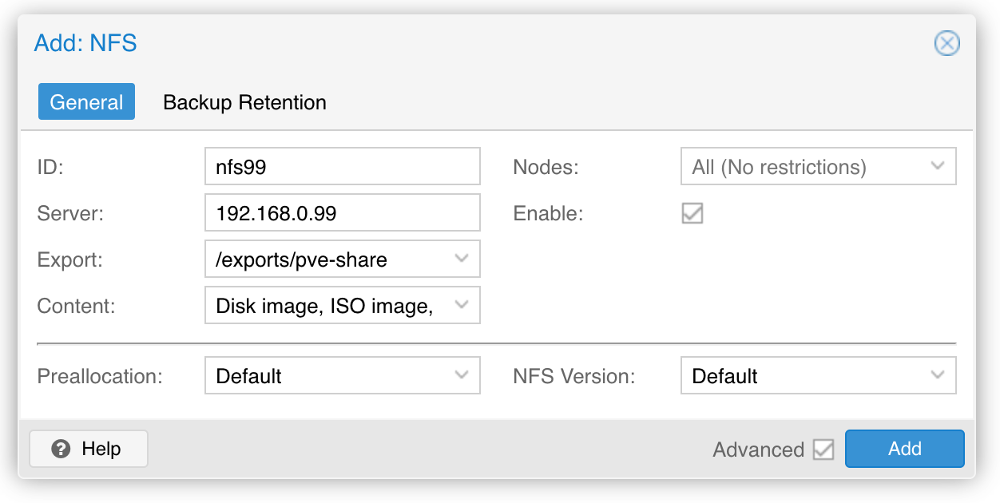

## 构想

在前面实现的软交换的基础上，顺便实现一个SSD NAS，方便其他机器存储资料，如 pve 相关的虚拟机备份/模版/iso等。

这样就实现了 56g 网络 + 高速 SSD 的 NAS。

> 备注：因为兼容性原因，56g的 hp544+ 这块 cx3 pro 的网卡无法直通多块网卡给单个虚拟机（可以直通一块卡，两块就报错，换cx4以上就正常），所以这台机器使用的是物理机安装 debian 12.7。

## 准备工作

### 准备物理机

软交换机器为了性能和兼容采用的是物理机方式安装 debian，插了四块 hp544+ 网卡，实现了 40g/56g 软交换。

基于 40g/56g 网卡的高速网络已经满足。

### 硬盘情况

机器上目前是一块256g的三星pm981a用来安装 debian 操作系统，两块三星pm983a 1t 用来做 nas，lspci 能看到这三块 ssd 硬盘：

```bash
$ lspci | grep Non-Volatile
03:00.0 Non-Volatile memory controller: Samsung Electronics Co Ltd NVMe SSD Controller SM981/PM981/PM983
04:00.0 Non-Volatile memory controller: Samsung Electronics Co Ltd NVMe SSD Controller SM981/PM981/PM983
07:00.0 Non-Volatile memory controller: Samsung Electronics Co Ltd NVMe SSD Controller SM981/PM981/PM983
```

还有一块东芝 mg08 14t 的机械硬盘，准备用来做资料备份。

分区情况：

```bash
$ sudo lsblk -l   

NAME      MAJ:MIN RM   SIZE RO TYPE MOUNTPOINTS
sda         8:0    0  12.7T  0 disk 
sda1        8:1    0  12.7T  0 part /var/data3
nvme1n1   259:0    0 838.4G  0 disk 
nvme0n1   259:1    0 838.4G  0 disk 
nvme1n1p1 259:2    0 838.4G  0 part /var/data2
nvme0n1p1 259:3    0 838.4G  0 part /var/data
nvme2n1   259:4    0 238.5G  0 disk 
nvme2n1p1 259:5    0   512M  0 part /boot/efi
nvme2n1p2 259:6    0 186.3G  0 part /
nvme2n1p3 259:7    0  51.7G  0 part /var/timeshift
```

用 fdisk 看更清晰一些：

```bash
$ sudo fdisk -l

Disk /dev/nvme1n1: 838.36 GiB, 900185481216 bytes, 1758174768 sectors
Disk model: MZ1LB960HBJR-000FB                      
Units: sectors of 1 * 512 = 512 bytes
Sector size (logical/physical): 512 bytes / 4096 bytes
I/O size (minimum/optimal): 131072 bytes / 131072 bytes
Disklabel type: gpt
Disk identifier: B724F254-A8C9-4FDD-B030-B68A85D4F6FD

Device         Start        End    Sectors   Size Type
/dev/nvme1n1p1  2048 1758173183 1758171136 838.4G Linux filesystem


Disk /dev/nvme0n1: 838.36 GiB, 900185481216 bytes, 1758174768 sectors
Disk model: MZ1LB960HBJR-000FB                      
Units: sectors of 1 * 512 = 512 bytes
Sector size (logical/physical): 512 bytes / 4096 bytes
I/O size (minimum/optimal): 131072 bytes / 131072 bytes
Disklabel type: gpt
Disk identifier: D495383E-8798-4B53-BED6-4CB6BBA29B74

Device         Start        End    Sectors   Size Type
/dev/nvme0n1p1  2048 1758173183 1758171136 838.4G Linux filesystem


Disk /dev/nvme2n1: 238.47 GiB, 256060514304 bytes, 500118192 sectors
Disk model: SAMSUNG MZVLB256HBHQ-000L7              
Units: sectors of 1 * 512 = 512 bytes
Sector size (logical/physical): 512 bytes / 512 bytes
I/O size (minimum/optimal): 512 bytes / 512 bytes
Disklabel type: gpt
Disk identifier: F33C8916-7384-11EF-A4EE-8B1FC28B9DC5

Device             Start       End   Sectors   Size Type
/dev/nvme2n1p1      2048   1050623   1048576   512M EFI System
/dev/nvme2n1p2   1050624 391675903 390625280 186.3G Linux filesystem
/dev/nvme2n1p3 391675904 500117503 108441600  51.7G Linux filesystem


Disk /dev/sda: 12.73 TiB, 14000519643136 bytes, 27344764928 sectors
Disk model: TOSHIBA MG08ACA1
Units: sectors of 1 * 512 = 512 bytes
Sector size (logical/physical): 512 bytes / 4096 bytes
I/O size (minimum/optimal): 4096 bytes / 4096 bytes
Disklabel type: gpt
Disk identifier: D64050D6-6671-0C41-9881-3E1CECCD24C1

Device     Start         End     Sectors  Size Type
/dev/sda1   2048 27344762879 27344760832 12.7T Linux filesystem
```

准备使用 `/dev/nvme1n1p1` / `/dev/nvme0n1p1` / `/dev/sda1` 这三个分区来存放 nfs 共享文件。在根目录下建立 "/data" 目录：

```bash
sudo mkdir /data
```

修改 timeshift 配置，将 `/data` 加入到 excludes 。

## 搭建 nas 服务器端

### 安装 nfs server

```bash
# 安装
sudo apt install nfs-kernel-server -y

# 开机自启
sudo systemctl start nfs-kernel-server
sudo systemctl enable nfs-kernel-server

# 验证
sudo systemctl status nfs-kernel-server
● nfs-server.service - NFS server and services
     Loaded: loaded (/lib/systemd/system/nfs-server.service; enabled; preset: enabled)
     Active: active (exited) since Tue 2024-09-17 04:06:44 CST; 28s ago
   Main PID: 1901 (code=exited, status=0/SUCCESS)
        CPU: 6ms

Sep 17 04:06:42 switch99 systemd[1]: Starting nfs-server.service - NFS server and services...
Sep 17 04:06:42 switch99 exportfs[1900]: exportfs: can't open /etc/exports for reading
Sep 17 04:06:44 switch99 systemd[1]: Finished nfs-server.service - NFS server and services.
```

### 配置 nfs v4

```bash
sudo vi /etc/default/nfs-common
```

修改内容如下

```properties
NEED_STATD="no"
NEED_IDMAPD="yes"
```

继续修改 nfs-kernel-server 的配置：

```bash
sudo vi /etc/default/nfs-kernel-server
```

修改内容:

```bash
# 这行新增
RPCNFSDOPTS="-N 2 -N 3"
# 这行已经存在，修改内容
RPCMOUNTDOPTS="--manage-gids -N 2 -N 3"
# 其他不动
```

重启 nfs-server

```bash
sudo systemctl restart nfs-server
```

### 配置 UFW 防火墙

安装 nfs 之后必须配置防火墙。先安装 ufw:

```bash
sudo apt install ufw -y
```

安装完成之后第一个必须执行的步骤就是开放 ssh 登录：

```bash
sudo ufw allow ssh
sudo ufw enable
```

然后是容许访问 nfs

```bash
sudo ufw allow from 192.168.0.0/16 to any port nfs
```

重启 ufw 并查看 ufw 状态:

```bash
sudo ufw reload
sudo ufw status
```

可以看到 2049 端口开放给 nfs 了。

```bash
$ sudo ufw status
[sudo] password for sky: 
Firewall reloaded
Status: active

To                         Action      From
--                         ------      ----
22/tcp                     ALLOW       Anywhere                  
2049                       ALLOW       192.168.0.0/16            
22/tcp (v6)                ALLOW       Anywhere (v6) 
```

备注：暂时不知道为什么 ufw 开启之后就无法访问 nfs 了，上面的 allow rule 没能生效。只好暂时先 `sudo ufw disable` 关闭防火墙先。

### 准备共享目录

为了方便后续的管理，采用伪文件系统

```bash
sudo mkdir -p /data/{share,pve-share}

sudo chown -R nobody:nogroup /data/share
sudo chown -R nobody:nogroup /data/pve-share
```

创建 export 目录：

```bash
sudo mkdir -p /exports/{share,pve-share}

sudo chown -R nobody:nogroup /exports
```

修改 `/etc/fstab` 文件来 mount 伪文件系统和 exports  

```bash
 sudo vi /etc/fstab
```

增加如下内容:

```bash
# nfs exports
/data/share /exports/share     none bind
/data/pve-share /exports/pve-share    none bind
```

### 配置 nfs export

```bash
sudo vi /etc/exports
```

修改 nfs exports 的内容:

```bash
/exports/share   192.168.0.0/16(rw,no_root_squash,no_subtree_check,crossmnt,fsid=0)
/exports/pve-share   192.168.0.0/16(rw,no_root_squash,no_subtree_check,crossmnt,fsid=0)
```

重启 nfs-kernel-server，查看 nfs-kernel-server 的状态：

```bash
sudo systemctl restart nfs-kernel-server
sudo systemctl status nfs-kernel-server
```

输出为：

```bash
nfs-server.service - NFS server and services
     Loaded: loaded (/lib/systemd/system/nfs-server.service; enabled; preset: enabled)
    Drop-In: /run/systemd/generator/nfs-server.service.d
             └─order-with-mounts.conf
     Active: active (exited) since Mon 2024-03-18 21:11:34 CST; 21ms ago
    Process: 6678 ExecStartPre=/usr/sbin/exportfs -r (code=exited, status=0/SUCCESS)
    Process: 6679 ExecStart=/usr/sbin/rpc.nfsd (code=exited, status=0/SUCCESS)
   Main PID: 6679 (code=exited, status=0/SUCCESS)
        CPU: 7ms

Mar 18 21:11:34 switch99 systemd[1]: Starting nfs-server.service - NFS server and services...
Mar 18 21:11:34 switch99 systemd[1]: Finished nfs-server.service - NFS server and services.
```

验证：

```bash
ps -ef | grep nfs
```

输出为：

```
root        4438       1  0 20:24 ?        00:00:00 /usr/sbin/nfsdcld
root        6682       2  0 21:11 ?        00:00:00 [nfsd]
root        6683       2  0 21:11 ?        00:00:00 [nfsd]
root        6684       2  0 21:11 ?        00:00:00 [nfsd]
root        6685       2  0 21:11 ?        00:00:00 [nfsd]
root        6686       2  0 21:11 ?        00:00:00 [nfsd]
root        6687       2  0 21:11 ?        00:00:00 [nfsd]
root        6688       2  0 21:11 ?        00:00:00 [nfsd]
root        6689       2  0 21:11 ?        00:00:00 [nfsd]
```

查看当前挂载情况：

```bash
sudo showmount -e
```

输出为:

```bash
Export list for switch99:
/exports 192.168.0.0/255.255.0.0
```

## nfs客户端

- https://www.howtoforge.com/tutorial/install-nfs-server-and-client-on-debian/： 主要参考这个文档的做法


## pve nfs storage

在 pve 下，点击 "datacenter" -> "storage" -> "Add"



备注: nfs version 这里无法选择 4 / 4.1 / 4.2，只能选择 default 。后续再看。

完成这个设置之后，该集群内的任何一台机器上，都会出现一个 `/mnt/pve/nfs99` 目录，mount 到 上面的 nfs exports。之后就可以通过这个目录像访问本地文件夹一样访问nfs。

### 清理 `/mnt/pve` 目录

如果多次操作 nfs 存储，比如添加后再删除，则在  `/mnt/pve/nfs99` 目录下会残留一些数据，如：

```bash
ls -la
ls: cannot access 'nfs-test11': Stale file handle
total 12
drwxr-xr-x 4 root   root    4096 Mar 18 22:26 .
drwxr-xr-x 3 root   root    4096 Mar 18 22:23 ..
drwxr-xr-x 7 nobody nogroup 4096 Mar 18 22:26 nfs99
d????????? ? ?      ?          ?            ? nfs-test11
```

这个 nfs-test11 就是删除之后的残余，不能直接删除：

```bash
rm -rf nfs-test11 
rm: cannot remove 'nfs-test11': Is a directory
```

而是要使用 umount 命令：

```bash
$ sudo umount nfs-test11 

$ ls -la                
total 16
drwxr-xr-x 4 root   root    4096 Mar 18 22:26 .
drwxr-xr-x 3 root   root    4096 Mar 18 22:23 ..
drwxr-xr-x 7 nobody nogroup 4096 Mar 18 22:26 nfs99
drwxr-xr-x 2 root   root    4096 Mar 18 22:23 nfs-test11

$ sudo rm -rf nfs-test11
```


### 复制 pve 文件

在 pve 页面上查看 backup 里面需要复制的备份，主要看虚拟机 id 和时间。

对于已经加入 pve 集群的机器，本地已经 mount 了 `/mnt/pve/nfs99` 目录，因此可以直接执行 cp 命令复制到 nfs 上：

```bash
cp /var/lib/vz/dump/vzdump-qemu-101-2024_02_12-16_13_09.* /mnt/pve/nfs99/dump
```

对于还没有加入 pve 集群的机器，需要先手工 mount nfs 到本地：

```bash
sudo mkdir -p /mnt/pve/nfs
sudo mount.nfs 192.168.0.99:/exports/pve-share /mnt/pve/nfs
# mount.nfs4 会报错，暂时不清楚问题出在哪里，mount.nfs 就可以正常使用
# sudo mount.nfs4 192.168.0.99:/exports/pve-share /mnt/pve/nfs
```

然后再复制 backup 文件：

```bash
cp /var/lib/vz/dump/vzdump-qemu-101-2024_02_12-16_13_09.* /mnt/pve/nfs/dump
```

为了方便备份各个机器独有的文件（而不是模版等可以共享的文件），在这个 nfs 目录下新建一个 node-backup 目录，并为每个节点建立一个子目录：

```bash
mkdir -p /mnt/pve/nfs/node-backup/skyserver4/dump
```

然后就可以复制

```bash
cp xxxx /mnt/pve/nfs/node-backup/skyserver4/dump
```


## 参考资料

- https://www.howtoforge.com/tutorial/install-nfs-server-and-client-on-debian/


