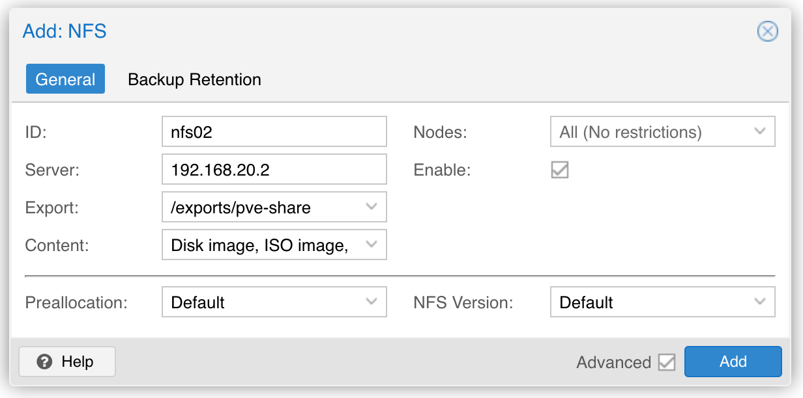

## 构想

在前面实现的软交换的基础上，直通一块 4t 的国产 pcie4 ssd 进入（型号为爱国者 p7000z），实现一个小型的纯 SSD NAS。

未来可能会陆续加入多块 ssd 进行扩容。

这样就实现了 25g 网络 + 高速 SSD 的 NAS。

## 准备工作

### 准备虚拟机

之前的利用 linux bridge 实现软交换的解决方案中，已经建立了一个名为 skynas3 的虚拟机。

基于 25g 网卡的高速网络已经满足。

### 硬盘直通

在开启 pve 直通的基础上，将硬盘直通到 skynas3 虚拟机中。

能看到这块 ssd 硬盘：

```bash
$ lspci | grep Non-Volatile
03:00.0 Non-Volatile memory controller: MAXIO Technology (Hangzhou) Ltd. NVMe SSD Controller MAP1602 (rev 01)
```

因为硬盘没有分区，所以看起来是这样：

```bash
lsblk -l                 
NAME    MAJ:MIN RM   SIZE RO TYPE MOUNTPOINTS
sda       8:0    0   512G  0 disk 
sda1      8:1    0   512M  0 part /boot/efi
sda2      8:2    0 465.7G  0 part /
sda3      8:3    0  45.8G  0 part /timeshift
sr0      11:0    1   3.7G  0 rom  
nvme0n1 259:0    0   3.7T  0 disk
```

sda 是虚拟机的磁盘，虚拟了 512g。

nvme0n1 是直通进来的 ssd 硬盘，4t 大小但实际为 3.7 T。

用 fdisk 看更清晰一些：

```bash
$ sudo fdisk -l
[sudo] password for sky: 
Disk /dev/sda: 512 GiB, 549755813888 bytes, 1073741824 sectors
Disk model: QEMU HARDDISK   
Units: sectors of 1 * 512 = 512 bytes
Sector size (logical/physical): 512 bytes / 512 bytes
I/O size (minimum/optimal): 512 bytes / 512 bytes
Disklabel type: gpt
Disk identifier: D53AE25D-B704-4192-A436-54BD53A9DAC0

Device         Start        End   Sectors   Size Type
/dev/sda1       2048    1050623   1048576   512M EFI System
/dev/sda2    1050624  977612799 976562176 465.7G Linux filesystem
/dev/sda3  977612800 1073739775  96126976  45.8G Linux filesystem


Disk /dev/nvme0n1: 3.73 TiB, 4096805658624 bytes, 8001573552 sectors
Disk model: aigo NVMe SSD P7000Z 4TB                
Units: sectors of 1 * 512 = 512 bytes
Sector size (logical/physical): 512 bytes / 512 bytes
I/O size (minimum/optimal): 512 bytes / 512 bytes
Disklabel type: gpt
Disk identifier: 9F1409D0-DA10-5446-8662-4ADAFBF1128F
```

### 硬盘分区

```bash
sudo fdisk /dev/nvme0n1
```

g 转为 GPT partition table
p 打印分区表
n 创建新分区，这里就只创建一个4t的大分区给 nas 用。

参考：

- https://www.cnblogs.com/renshengdezheli/p/13941563.html


分区完成后查看这块硬盘的情况：

```bash
$ sudo fdisk -l

Disk /dev/nvme0n1: 3.73 TiB, 4096805658624 bytes, 8001573552 sectors
Disk model: aigo NVMe SSD P7000Z 4TB                
Units: sectors of 1 * 512 = 512 bytes
Sector size (logical/physical): 512 bytes / 512 bytes
I/O size (minimum/optimal): 512 bytes / 512 bytes
Disklabel type: gpt
Disk identifier: BCA9FF34-B3F2-B44D-B385-041E061B8F52

Device         Start        End    Sectors  Size Type
/dev/nvme0n1p1  2048 8001572863 8001570816  3.7T Linux filesystem
```

将这个分区格式化为 ext4 格式：

```bash
sudo mkfs.ext4 /dev/nvme0n1p1
mke2fs 1.47.0 (5-Feb-2023)
Discarding device blocks: done                            
Creating filesystem with 1000196352 4k blocks and 250052608 inodes
Filesystem UUID: 1b50172f-44fd-46a3-8499-b169d7d91eac
Superblock backups stored on blocks: 
	32768, 98304, 163840, 229376, 294912, 819200, 884736, 1605632, 2654208, 
	4096000, 7962624, 11239424, 20480000, 23887872, 71663616, 78675968, 
	102400000, 214990848, 512000000, 550731776, 644972544

Allocating group tables: done                            
Writing inode tables: done                            
Creating journal (262144 blocks): done
Writing superblocks and filesystem accounting information: done 
```

### 挂载分区

查看 ssd 分区的 uuid：

```bash
sudo lsblk -f
[sudo] password for sky: 
NAME        FSTYPE FSVER LABEL UUID                                 FSAVAIL FSUSE% MOUNTPOINTS
sda                                                                                
├─sda1      vfat   FAT32       80D7-F301                             505.1M     1% /boot/efi
├─sda2      ext4   1.0         59bbb3ad-27e7-4e1e-b40e-0e6a8a8386cc  430.8G     1% /
└─sda3      ext4   1.0         d5aaad4b-8382-4153-adfc-f7c797e74ee5   38.6G     9% /timeshift
nvme0n1                                                                            
└─nvme0n1p1 ext4   1.0         b4e82288-5290-4d64-a45e-94c4ef657611
```

执行

```bash
sudo vi /etc/fstab
```

查看目前现有的三个分区的挂载情况：

```bash
# / was on /dev/sda2 during installation
UUID=59bbb3ad-27e7-4e1e-b40e-0e6a8a8386cc /               ext4    errors=remount-ro 0       1
# /boot/efi was on /dev/sda1 during installation
UUID=80D7-F301  /boot/efi       vfat    umask=0077      0       1
# /timeshift was on /dev/sda3 during installation
UUID=d5aaad4b-8382-4153-adfc-f7c797e74ee5 /timeshift      ext4    defaults        0       2
```

增加第一块 ssd 硬盘的挂载，挂载到 "/mnt/storage1"：

```bash
# /storage1 was on /dev/nvme0n1p1(aigo p7000z 4t)
UUID=b4e82288-5290-4d64-a45e-94c4ef657611 /mnt/storage1      ext4    defaults        0       2
```

重启机器。再看一下分区挂载情况：

```bash
$ sudo lsblk -f

NAME        FSTYPE FSVER LABEL UUID                                 FSAVAIL FSUSE% MOUNTPOINTS
sda                                                                                
├─sda1      vfat   FAT32       80D7-F301                             505.1M     1% /boot/efi
├─sda2      ext4   1.0         59bbb3ad-27e7-4e1e-b40e-0e6a8a8386cc  430.7G     1% /
└─sda3      ext4   1.0         d5aaad4b-8382-4153-adfc-f7c797e74ee5   38.6G     9% /timeshift
nvme0n1                                                                            
└─nvme0n1p1 ext4   1.0         b4e82288-5290-4d64-a45e-94c4ef657611    3.5T     0% /mnt/storage1
```

### 准备共享目录

为了方便后续的管理，采用伪文件系统:

```bash
cd /mnt/storage1 

sudo mkdir share
sudo mkdir pve-share

sudo chown -R nobody:nogroup /mnt/storage1/share
sudo chown -R nobody:nogroup /mnt/storage1/pve-share
```

创建 export 目录：

```bash
sudo mkdir -p /exports/{share,pve-share}

sudo chown -R nobody:nogroup /exports
```

修改 `/etc/fstab` 文件来 mount 伪文件系统和 exports

```bash
 sudo vi /etc/fstab
```

增加如下内容:

```bash
# nfs exports
/mnt/storage1/share /exports/share     none bind
/mnt/storage1/pve-share /exports/pve-share    none bind
```

重启。

## 搭建 nas

### 安装 nfs server

```bash
# 安装
sudo apt install nfs-kernel-server -y

# 开机自启
sudo systemctl start nfs-kernel-server
sudo systemctl enable nfs-kernel-server

# 验证
sudo systemctl status nfs-kernel-server
Jan 29 20:40:15 skynas3 systemd[1]: Starting nfs-server.service - NFS server and services...
Jan 29 20:40:15 skynas3 exportfs[1422]: exportfs: can't open /etc/exports for reading
Jan 29 20:40:16 skynas3 systemd[1]: Finished nfs-server.service - NFS server and services.
```

### 配置 nfs v4

```bash
sudo vi /etc/default/nfs-common
```

修改内容如下

```properties
NEED_STATD="no"
NEED_IDMAPD="yes"
```

继续修改 nfs-kernel-server 的配置：

```bash
sudo vi /etc/default/nfs-kernel-server
```

修改内容:

```bash
# 这行新增
RPCNFSDOPTS="-N 2 -N 3"
# 这行已经存在，修改内容
RPCMOUNTDOPTS="--manage-gids -N 2 -N 3"
# 其他不动
```

### 配置 nfs export

```bash
sudo vi /etc/exports
```

修改 nfs exports 的内容，这里我们先 export 第一块4t ssd 硬盘的 share/pve-share 目录：

```bash
/exports/share   192.168.0.0/16(rw,no_root_squash,no_subtree_check,crossmnt,fsid=0)
/exports/pve-share   192.168.0.0/16(rw,no_root_squash,no_subtree_check,crossmnt,fsid=0)
```

重启 nfs-kernel-server，查看 nfs-kernel-server 的状态：

```bash
sudo systemctl restart nfs-kernel-server
sudo systemctl status nfs-kernel-server
```

输出为：

```bash
nfs-server.service - NFS server and services
     Loaded: loaded (/lib/systemd/system/nfs-server.service; enabled; preset: enabled)
    Drop-In: /run/systemd/generator/nfs-server.service.d
             └─order-with-mounts.conf
     Active: active (exited) since Wed 2024-03-20 23:09:19 EDT; 17ms ago
    Process: 863 ExecStartPre=/usr/sbin/exportfs -r (code=exited, status=0/SUCCESS)
    Process: 864 ExecStart=/usr/sbin/rpc.nfsd (code=exited, status=0/SUCCESS)
   Main PID: 864 (code=exited, status=0/SUCCESS)
        CPU: 7ms

Mar 20 23:09:19 skynas3 systemd[1]: Starting nfs-server.service - NFS server and services...
Mar 20 23:09:19 skynas3 systemd[1]: Finished nfs-server.service - NFS server and services.
```

验证：

```bash
ps -ef | grep nfs
```

输出为：

```
ps -ef | grep nfs
root         714       1  0 23:04 ?        00:00:00 /usr/sbin/nfsdcld
root         866       2  0 23:09 ?        00:00:00 [nfsd]
root         867       2  0 23:09 ?        00:00:00 [nfsd]
root         868       2  0 23:09 ?        00:00:00 [nfsd]
root         869       2  0 23:09 ?        00:00:00 [nfsd]
root         870       2  0 23:09 ?        00:00:00 [nfsd]
root         871       2  0 23:09 ?        00:00:00 [nfsd]
root         872       2  0 23:09 ?        00:00:00 [nfsd]
root         873       2  0 23:09 ?        00:00:00 [nfsd]
```

查看当前挂载情况：

```bash
sudo showmount -e
```

输出为:

```bash
Export list for skynas3:
/exports/pve-share 192.168.0.0/16
/exports/share     192.168.0.0/16
```

## nfs客户端

- https://www.howtoforge.com/tutorial/install-nfs-server-and-client-on-debian/： 主要参考这个文档的做法

## pve nfs storage

在 pve 下，点击 “datacenter” -> “storage” -> “Add”



备注: nfs version 这里无法选择 4 / 4.1 / 4.2，只能选择 default 。后续再看。

完成这个设置之后，该集群内的任何一台机器上，都会出现一个 `/mnt/pve/nfs99` 目录，mount 到 上面的 nfs exports。之后就可以通过这个目录像访问本地文件夹一样访问nfs。

## 遇到的问题

### nfs 残余数据

期间遇到一个问题，我先创建了一个 nfs storage，指向了 share 目录。后来发现需要 export 两个目录，普通 share 和 pve 专用的 pve-share，避免将两者的文件混合起来。

然后就遇到问题：旧的 nfs storage 删除之后，再创建同名的 nfs storage 指向新的 pve-share，但实际操作的依然是旧的 share。反复尝试过各种方法都无效。

- 清理 `/mnt/pve/` 目录
- 清理 `/var/lib/rrdcached/db/pve2-storage/` 目录

```bash
sudo find / -type f -exec grep "nfs02" {} \;
grep: /var/log/journal/4ba9084c7be94c57a943bf7c2aa034a5/system.journal: binary file matches
update /var/lib/rrdcached/db/pve2-storage/skyaio2/nfs02 1710992038:4031332220928:0
```

只好在清理完这些信息之后，再用一个新的名字重新创建 nfs storage，比如 nfs02-ssd 。

## 参考资料

- https://www.linuxtechi.com/how-to-install-nfs-server-on-debian/
- https://www.howtoforge.com/tutorial/install-nfs-server-and-client-on-debian/
- https://www.server-world.info/en/note?os=Debian_12&p=nfs&f=1