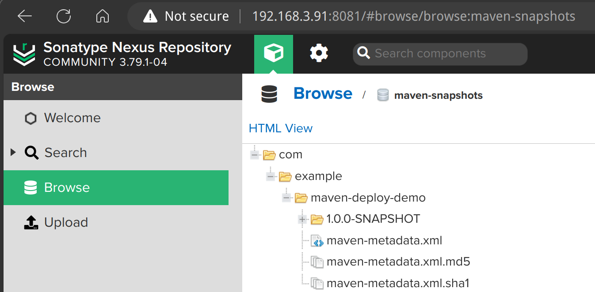

## 安装

### sdkman 安装

列出当前系统中所有可用的 maven 版本：

```bash
sdk list maven
```

输出为：

```bash
Available Maven Versions
     4.0.0-rc-4          3.8.7               3.3.9                              
     3.9.11              3.8.6               3.3.3                              
     3.9.10              3.8.5               3.3.1                              
     3.9.9               3.8.4               3.2.5                              
     3.9.8               3.8.3               3.2.3                              
     3.9.7               3.8.2               3.2.2                              
     3.9.6               3.8.1               3.2.1                              
     3.9.5               3.6.3               3.1.1                              
     3.9.4               3.6.2               3.1.0                              
     3.9.3               3.6.1               3.0.5                              
     3.9.2               3.6.0               3.0.4                              
     3.9.1               3.5.4                                                  
     3.9.0               3.5.3                                                  
     3.8.9               3.5.2                                                  
     3.8.8               3.5.0                                                              

================================================================================
+ - local version
* - installed
> - currently in use
================================================================================
``` 

安装指定版本的 maven, 4.0 还是 rc 版本, 先用 3.9 系列：

```bash
sdk install maven 3.9.11
```

输出为：

```bash
Downloading: maven 3.9.11

In progress...

########################################################################################################################################### 100.0%

Installing: maven 3.9.11
Done installing!
```

查看安装的版本:

```bash
$ ls ~/.sdkman/candidates/maven/

3.9.11
```

sdk default maven 3.9.11


重启 shell 或者执行下列命令重新加载 sdkman ：

```bash
source ~/.sdkman/bin/sdkman-init.sh
```

验证 maven 安装版本：

```bash
$ mvn --version

Apache Maven 3.9.11 (3e54c93a704957b63ee3494413a2b544fd3d825b)
Maven home: /home/sky/.sdkman/candidates/maven/current
Java version: 21.0.9, vendor: Azul Systems, Inc., runtime: /home/sky/.sdkman/candidates/java/21.0.9-zulu
Default locale: en_US, platform encoding: UTF-8
OS name: "linux", version: "6.12.48+deb13-amd64", arch: "amd64", family: "unix"
```

## 配置

### 配置代理服务器

如有需要，配置代理服务器：

```bash
export MAVEN_OPTS="-DsocksProxyHost=192.168.0.1 -DsocksProxyPort=7891"
```

### 配置 maven 仓库

maven 的 settings.xml 文件可以在多个地方配置，优先级从高到低依次为：

1. 用户目录下的 `.m2/settings.xml` 文件
2. 项目根目录下的 `pom.xml` 文件
3. 全局配置文件, 一般在 maven 安装路径下的 `conf/settings.xml` 文件

在当前用户目录下创建 `.m2` 目录：

```bash
mkdir -p ~/.m2                   
cd ~/.m2
```

在 `.m2` 目录下创建 `settings.xml` 文件：

```bash
vi settings.xml
```

在 `settings.xml` 文件中添加如下内容：

```xml
<settings xmlns="http://maven.apache.org/SETTINGS/1.0.0"
          xmlns:xsi="http://www.w3.org/2001/XMLSchema-instance"
          xsi:schemaLocation="http://maven.apache.org/SETTINGS/1.0.0 https://maven.apache.org/xsd/settings-1.0.0.xsd">

    <servers>
        <server>
            <id>maven-releases</id>
            <username>deployment</username>
            <password>xxxxxxxx</password>
        </server>
        <server>
            <id>maven-snapshots</id>
            <username>deployment</username>
            <password>xxxxxxxx</password>
        </server>
    </servers>
   
    <mirrors>
        <mirror>
            <id>nexus-mirror</id>
            <name>Nexus Repository</name>
            <url>http://192.168.3.91:8081/repository/maven-public/</url>
            <mirrorOf>*</mirrorOf>
        </mirror>
    </mirrors>
    
    <profiles>
        <profile>
            <id>nexus</id>
            <properties>
                <altSnapshotDeploymentRepository>maven-snapshots::default::http://192.168.3.91:8081/repository/maven-snapshots/</altSnapshotDeploymentRepository>
                <altReleaseDeploymentRepository>maven-releases::default::http://192.168.3.91:8081/repository/maven-releases/</altReleaseDeploymentRepository>
            </properties>
            <repositories>
                <repository>
                    <id>maven-releases</id>
                    <url>http://192.168.3.91:8081/repository/maven-releases/</url>
                    <releases><enabled>true</enabled></releases>
                    <snapshots><enabled>false</enabled></snapshots>
                </repository>
                <repository>
                    <id>maven-snapshots</id>
                    <url>http://192.168.3.91:8081/repository/maven-snapshots/</url>
                    <releases><enabled>false</enabled></releases>
                    <snapshots><enabled>true</enabled></snapshots>
                </repository>
            </repositories>
        </profile>
    </profiles>

    
    <activeProfiles>
        <activeProfile>nexus</activeProfile>
    </activeProfiles>
</settings>
```

## 验证

### 验证 nexus 代理仓库的缓存功能

```bash
mkdir -p ~/work/code/temp/java-demo
cd ~/work/code/temp/java-demo

git clone https://github.com/dapr/java-sdk.git
cd java-sdk

mvn install -DskipTests -Djacoco.skip=true
```

第一次运行时，会因为要下载大量的依赖，速度非常慢。

之后检查 nexus 的 maven-public 和 maven-central 仓库，会发现缓存了很多依赖。

验证 nexus 缓存的效果，可以先删除本地已经下载的 maven 依赖：

```bash
rm -rf ~/.m2/repository
```

然后再次执行 maven 命令，会发现速度非常快。

### 验证 nexus hosted 仓库的上传功能

指定 maven deploy 时要用的分发仓库的方式有三种：

1. 在 pom.xml 中配置分发仓库

    ```xml
    <distributionManagement>
    <snapshotRepository>
        <id>maven-snapshots</id>
        <url>http://192.168.0.246:8081/repository/maven-snapshots/</url>
    </snapshotRepository>
    <repository>
        <id>maven-releases</id>
        <url>http://192.168.0.246:8081/repository/maven-releases/</url>
    </repository>
    </distributionManagement>
    ```

    这个方式要在每个项目的 pom.xml 中配置分发仓库，如果项目很多，配置起来比较麻烦。不推荐。

2. 在命令行中强制指定仓库

    ```bash
    mvn deploy -DaltDeploymentRepository=maven-snapshots::default::http://192.168.0.246:8081/repository/maven-snapshots/
    ```

    这个方式每次执行 maven deploy 命令时都要指定仓库，也嫌麻烦。不推荐。

3. 在 settings.xml 中配置分发仓库

    在配置 profile 时，可以设置 altSnapshotDeploymentRepository 和 altReleaseDeploymentRepository 属性，指定分发仓库。

    ```xml
    <profiles>
        <profile>
            <id>nexus</id>
            <properties>
                <altSnapshotDeploymentRepository>maven-snapshots::default::http://192.168.0.246:8081/repository/maven-snapshots/</altSnapshotDeploymentRepository>
                <altReleaseDeploymentRepository>maven-releases::default::http://192.168.0.246:8081/repository/maven-releases/</altReleaseDeploymentRepository>
            </properties>
            <repositories>
            </repositories>
        </profile>
    </profiles>
    ```

    这样执行 maven deploy 命令时，会使用配置的分发仓库。非常方便。

注意： 要在项目的 pom.xml 中配置使用 maven-deploy-plugin 插件，不要使用 nexus-staging-maven-plugin。

```xml
<project>
    ......
    <build>
        <plugins>
            <plugin>
                <groupId>org.apache.maven.plugins</groupId>
                <artifactId>maven-deploy-plugin</artifactId>
                <version>3.1.4</version>
            </plugin>
        </plugins>
    </build>
</project>
```

### demo 验证

```bash
mkdir -p ~/work/code/temp/java-demo
cd ~/work/code/temp/java-demo


# 现在不能直接从 github 下载了？
#wget https://github.com/skyao/learning-debian/blob/main/content/zh-cn/docs/develop/langurage/java/maven/images/maven-deploy-demo.tar

# 先收工下载到本地，再scp 传输文件到 devserver91 机器备用
# scp ./maven-deploy-demo.tar sky@192.168.3.91:/home/sky/work/code/temp/java-demo
# 以后用的时候再从 devserver91 机器下载
scp sky@192.168.3.91:/home/sky/work/code/temp/java-demo/maven-deploy-demo.tar .

tar -xvf maven-deploy-demo.tar
cd maven-deploy-demo

mvn deploy
```

输出为：

```bash
......
Uploading to maven-snapshots: http://192.168.3.91:8081/repository/maven-snapshots/com/example/maven-deploy-demo/1.0.0-SNAPSHOT/maven-deploy-demo-1.0.0-20250507.023145-1.pom
Uploaded to maven-snapshots: http://192.168.3.91:8081/repository/maven-snapshots/com/example/maven-deploy-demo/1.0.0-SNAPSHOT/maven-deploy-demo-1.0.0-20250507.023145-1.pom (887 B at 25 kB/s)
Uploading to maven-snapshots: http://192.168.3.91:8081/repository/maven-snapshots/com/example/maven-deploy-demo/1.0.0-SNAPSHOT/maven-deploy-demo-1.0.0-20250507.023145-1.jar
Uploaded to maven-snapshots: http://192.168.3.91:8081/repository/maven-snapshots/com/example/maven-deploy-demo/1.0.0-SNAPSHOT/maven-deploy-demo-1.0.0-20250507.023145-1.jar (2.2 kB at 118 kB/s)
Downloading from maven-snapshots: http://192.168.3.91:8081/repository/maven-snapshots/com/example/maven-deploy-demo/maven-metadata.xml
Uploading to maven-snapshots: http://192.168.3.91:8081/repository/maven-snapshots/com/example/maven-deploy-demo/1.0.0-SNAPSHOT/maven-metadata.xml
Uploaded to maven-snapshots: http://192.168.3.91:8081/repository/maven-snapshots/com/example/maven-deploy-demo/1.0.0-SNAPSHOT/maven-metadata.xml (778 B at 46 kB/s)
Uploading to maven-snapshots: http://192.168.3.91:8081/repository/maven-snapshots/com/example/maven-deploy-demo/maven-metadata.xml
Uploaded to maven-snapshots: http://192.168.3.91:8081/repository/maven-snapshots/com/example/maven-deploy-demo/maven-metadata.xml (288 B at 19 kB/s)
[INFO] ------------------------------------------------------------------------
[INFO] BUILD SUCCESS
[INFO] ------------------------------------------------------------------------
[INFO] Total time:  16.809 s
[INFO] Finished at: 2025-05-07T10:32:01+08:00
[INFO] ------------------------------------------------------------------------
```

在 nexus 的 maven-snapshots 仓库中可以看到刚刚上传的 maven-deploy-demo 的 pom 和 jar 文件：

