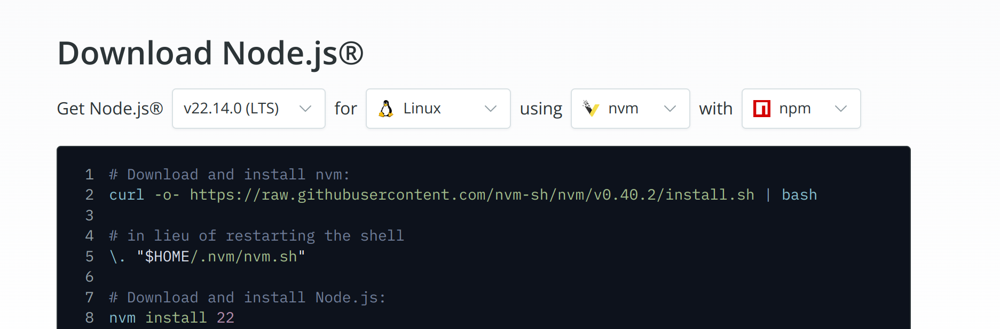
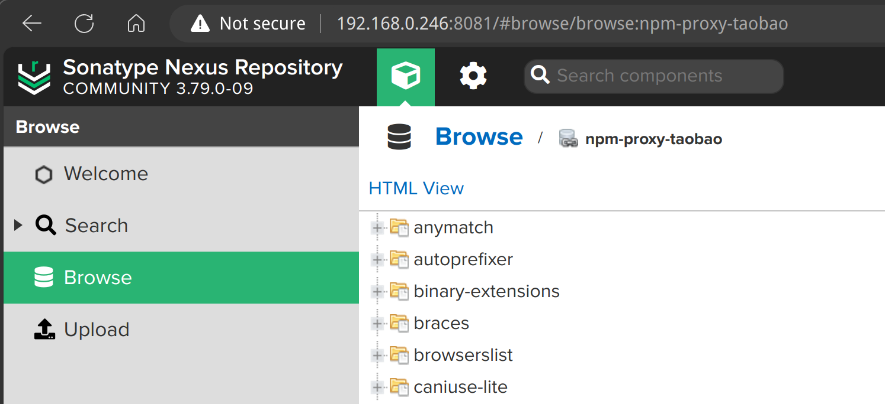

## 安装

在以下网站下载nodejs的安装包：

https://nodejs.org/en/download



按照提示进行安装即可：

```bash
# Download and install nvm:
curl -o- https://raw.githubusercontent.com/nvm-sh/nvm/v0.40.2/install.sh | bash

# in lieu of restarting the shell
\. "$HOME/.nvm/nvm.sh"

# Download and install Node.js:
nvm install 22

# Verify the Node.js version:
node -v # Should print "v22.14.0".
nvm current # Should print "v22.14.0".

# Verify npm version:
npm -v # Should print "10.9.2".
```

安装完成后验证：

```bash
$ node -v
v22.14.0

$ nvm current
v22.14.0

$ npm -v 
10.9.2
```

这里用了 nvm 来进行跨平台的 node 多版本管理。

> "nvm" is a cross-platform Node.js version manager

### 升级 npm

有时会提示 npm 有新版本，可以升级：

```bash
npm notice
npm notice New major version of npm available! 10.9.2 -> 11.3.0
npm notice Changelog: https://github.com/npm/cli/releases/tag/v11.3.0
npm notice To update run: npm install -g npm@11.3.0
npm notice
```

升级：

```bash
npm install -g npm@11.3.0
```

## 配置 npm 镜像源

查看当前默认的镜像源：

```bash
npm config get registry
```

输出为：

```bash
https://registry.npmjs.org/
```

### 查看 npm 镜像源的速度

安装 nrm 来测试各源的速度：

```bash
npm install -g nrm
```

列出可用源：

```bash
nrm ls
```

输出为：

```bash
  npm ---------- https://registry.npmjs.org/
  yarn --------- https://registry.yarnpkg.com/
  tencent ------ https://mirrors.tencent.com/npm/
  cnpm --------- https://r.cnpmjs.org/
  taobao ------- https://registry.npmmirror.com/
  npmMirror ---- https://skimdb.npmjs.com/registry/
  huawei ------- https://repo.huaweicloud.com/repository/npm/
```

切换源（例如切换到淘宝源）：

```bash
nrm use taobao
```

测试各源速度：

```bash
nrm test
```

输出为：

```bash
  npm ---------- 171 ms
  yarn --------- 125 ms
  tencent ------ 472 ms
  cnpm --------- 175 ms
  taobao ------- 113 ms
  npmMirror ---- 1516 ms
  huawei ------- 461 ms
```

可以看到淘宝源的速度最快，切换过去：

```bash
nrm use taobao
```

此时打开文件 `~/.npmrc` :

```bash
vi ~/.npmrc
```

可以看到淘宝的 npm 镜像网站 registry.npmmirror.com 已经配置好了：

```bash
home=https://npmmirror.com
registry=https://r.cnpmjs.org/
```

### 配置 npm 镜像源

也可以手工修改 `~/.npmrc` 文件：

```bash
vi ~/.npmrc
```

添加以下内容：

```bash
home=https://cnpmjs.org
registry=https://r.cnpmjs.org/
```

## 配置 nexus 代理仓库

### 新建代理仓库

在 nexus 中新建两个 npm proxy 代理仓库：

- npm-proxy-taobao： 代理地址为 https://registry.npmmirror.com
- npm-proxy-cnpm： 代理地址为 https://r.cnpmjs.org

再新建一个名为 npm-public 的 npm group 仓库，将上面两个仓库加入其中，顺序为：

- npm-proxy-taobao
- npm-proxy-cnpm

### 使用代理仓库

使用代理仓库：

```bash
vi ~/.npmrc
```

设置为以下内容：

```bash
home=http://192.168.0.246:8081
registry=http://192.168.0.246:8081/repository/npm-public/
```

### 验证代理

安装一些东西：

```bash
npm install --save-dev autoprefixer
npm install --save-dev postcss-cli
npm install -D postcss
```

然后去看 nexus 的代理仓库：



可以看到代理仓库中已经有了这些包。


