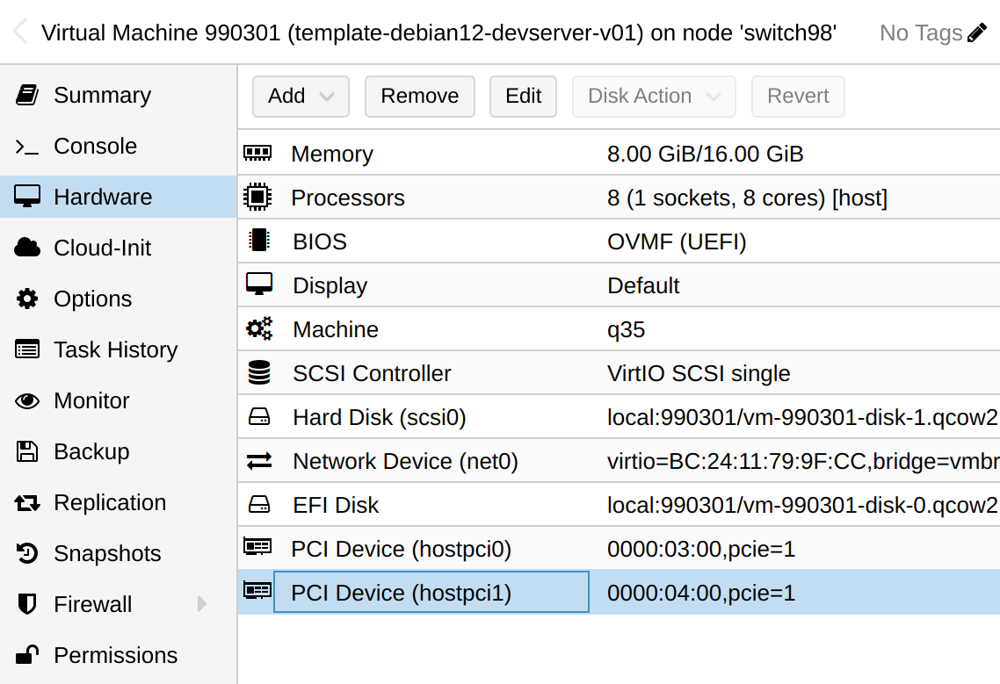

## 准备工作

### 准备虚拟机

从模版 template-debian12-basic-v03 （取最新版本） 克隆一个虚拟机，命名为 template-debian12-devserver-v01，VM ID 为 990301.

开发需要的 cpu 和内存稍大，修改虚拟机参数，cpu 修改为 8 核，内存 16g（mini 8192，memory 16384）。

### 准备磁盘

devserver 预计会有两台实例，用于两个异地的开发环境。

我为每台实例都准备了 2 块三星 pm983a 900G 的 ssd 磁盘，一块用于应用（如数据库，redis，queue等），一块用于数据（如pve需要的nfs，nexus 代理仓库等）。

在 pve 中，将两块 ssd 磁盘直通给到虚拟机，并挂载到 `/mnt/data` 目录。



在虚拟机中可以看到这两块磁盘：

```bash
lspci | grep Non-Volatile
01:00.0 Non-Volatile memory controller: Samsung Electronics Co Ltd NVMe SSD Controller SM981/PM981/PM983
02:00.0 Non-Volatile memory controller: Samsung Electronics Co Ltd NVMe SSD Controller SM981/PM981/PM983
```

参考本读书笔记中的 [devserver91](../../../../storage/devserver91/) 一节, 配置好磁盘并进行分区，然后安装 nfs server。

## 搭建开发环境

### 安装 docker 和 habor

- docker/docker-compose: https://skyao.net/learning-docker/docs/installation/debian12/
- habor: https://skyao.net/learning-docker/docs/repository/habor/

### 安装开发工具

参考本读书笔记中的 [开发工具](../../../tools/) 一节, 安装开发工具:

- sdkman
- nexus

### 语言 sdk 和 nexus 私库

参考本读书笔记中的 [编程语言](../../../langurage/) 一节, 安装语言 sdk 和对应的 nexus 私库:

- Java： 包括 maven
- golang
- rust
- python
- nodejs


