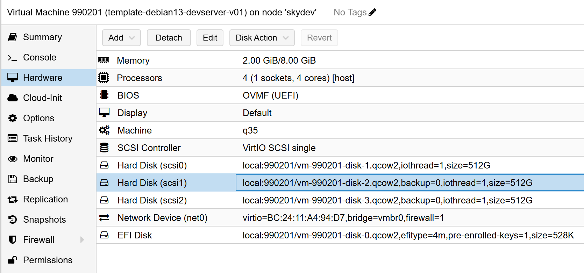

## 准备工作

以 debian 13 为例，debian13 后开发服务器不再是一台独立服务器和两块单独的 ssd 硬盘。所有构建方式和之前的有比较大的差异。

### 准备虚拟机

从模版 template-debian13-basic-v01 （取最新版本） full clone 克隆一个虚拟机，命名为 template-debian13-devserver-v01，VM ID 为 990201.

开发需要的 cpu 和内存稍大，修改虚拟机参数，cpu 修改为 8 核，内存 16g（mini 8192，memory 16384）。

### 准备磁盘

devserver 预计会有两台实例，用于两个异地的开发环境。

为每台实例准备了 2 块两块额外的磁盘，一块用于应用（如数据库，redis，queue等），一块用于数据（如pve需要的nfs，habor / nexus 代理仓库等）。在虚拟机硬件中，增加两块 hard disk，大小为 1024g，scsi 类型，virtIO scsi 控制器。注意把 backup 选项勾选去掉。

在 pve 中，将两块 hard disk 磁盘添加到虚拟机:



在虚拟机中可以看到这两块磁盘：

```bash
lspci | grep storage
09:01.0 SCSI storage controller: Red Hat, Inc. Virtio SCSI
09:02.0 SCSI storage controller: Red Hat, Inc. Virtio SCSI
09:03.0 SCSI storage controller: Red Hat, Inc. Virtio SCSI
```

参考本读书笔记中的 [devserver193](../../../../storage/devserver193/) 一节, 配置好磁盘并进行分区，并挂载到 `/mnt/data` 和 `/mnt/app` 目录, 然后安装 nfs server。

## 搭建开发环境

### 安装 docker 和 habor

- docker/docker-compose: https://skyao.net/learning-docker/docs/installation/debian12/
- habor: https://skyao.net/learning-docker/docs/repository/habor/

### 安装开发工具

参考本读书笔记中的 [开发工具](../../../tools/) 一节, 安装开发工具:

- sdkman
- nexus

### 语言 sdk 和 nexus 私库

参考本读书笔记中的 [编程语言](../../../langurage/) 一节, 安装语言 sdk 和对应的 nexus 私库:

- Java： 包括 maven
- golang
- rust
- python
- nodejs


