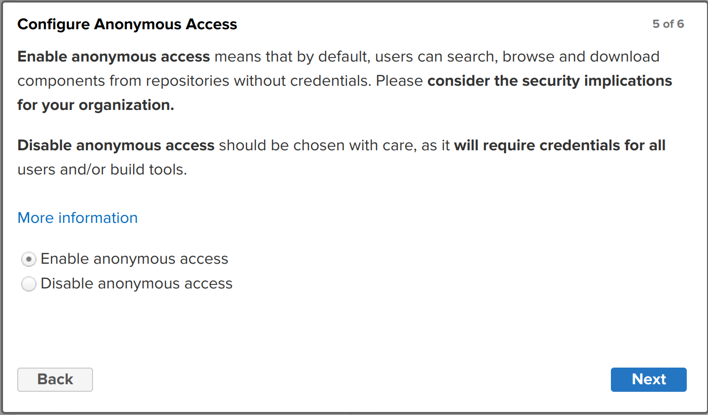
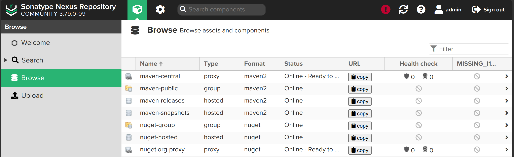

Nexus Repository Manager 是一个强大的仓库管理工具，支持多种仓库类型，包括 Maven、go module 等。它提供了一个集中的存储库，用于存储和管理软件包，并提供了一个安全的访问控制机制。

> 备注： 之所以选择 nexus 而不是 artifactory，是因为 nexus 是开源的，而 artifactory 是闭源+收费的。

以下以 nexus 3.79.1-04 为例，介绍如何安装和配置 nexus。

参考官方文档： https://help.sonatype.com/en/sonatype-nexus-repository.html

## 准备

创建 nexus 用户专门用于运行 nexus：

```bash
sudo useradd -M -d /mnt/data/nexus -s /bin/zsh -r nexus
```

创建 nexus 目录：

```bash
sudo mkdir -p /mnt/data/nexus
sudo chown -R nexus:nexus /mnt/data/nexus
```

## 下载

从下面地址找到 nexus 安装包：

https://help.sonatype.com/en/download-archives---repository-manager-3.html

从官方下载 nexus 安装包 nexus-3.79.1-04：

```bash
cd /mnt/data/nexus
sudo wget https://download.sonatype.com/nexus/3/nexus-3.79.1-04-linux-x86_64.tar.gz
```

> 备注： 这个版本是自带 jdk 的，因此不需要单独安装 jdk。自带的 jdk 在 `nexus/jdk/temurin_17.0.13_11_linux_x86_64` 目录下。

解压安装包：

```bash
sudo tar -xzf nexus-3.79.1-04-linux-x86_64.tar.gz -C /mnt/data/nexus
sudo rm -rf nexus-3.79.1-04-linux-x86_64.tar.gz
sudo chown -R nexus:nexus /mnt/data/nexus
```

重命名 nexus 目录去掉版本信息（方便以后升级版本）：

```bash
sudo mv nexus-3.79.1-04 nexus
```

得到如下目录：

```bash
$ ls -la
drwxr-xr-x 8 nexus nexus 4096 Apr  7 10:32 nexus
drwxr-xr-x 3 nexus nexus 4096 Mar 29 04:56 sonatype-work
```

## 安装

参考官方文档：

https://help.sonatype.com/en/install-nexus-repository.html

```bash
cd nexus/bin
```

这个目录下的 `nexus` 是启动脚本，`nexus.vmoptions` 是 jvm 配置文件。

查看 `nexus.vmoptions` 文件，可以看到默认的数据和日志目录：

```bash
-XX:LogFile=../sonatype-work/nexus3/log/jvm.log
-Dkaraf.home=.
-Dkaraf.base=.
-Dkaraf.data=../sonatype-work/nexus3
-Dkaraf.log=../sonatype-work/nexus3/log
-Djava.io.tmpdir=../sonatype-work/nexus3/tmp
```

配置系统服务：

```bash
sudo vi /etc/systemd/system/nexus.service
```

添加如下内容：

```properties
[Unit]
Description=Nexus Repository Manager
After=network.target

[Service]
Type=forking
User=nexus
Group=nexus
ExecStart=/mnt/data/nexus/nexus/bin/nexus start
ExecStop=/mnt/data/nexus/nexus/bin/nexus stop
Restart=on-failure
RestartSec=30
LimitNOFILE=65536

[Install]
WantedBy=multi-user.target
```

启用并启动服务：

```bash
sudo systemctl daemon-reload
sudo systemctl enable nexus
sudo systemctl start nexus
```

检查状态：

```bash
$ sudo systemctl status nexus

● nexus.service - Nexus Repository Manager
     Loaded: loaded (/etc/systemd/system/nexus.service; enabled; preset: enabled)
     Active: active (running) since Mon 2025-04-07 10:32:27 CST; 4min 7s ago
    Process: 4495 ExecStart=/opt/nexus/nexus/bin/nexus start (code=exited, status=0/SUCCESS)
   Main PID: 4736 (java)
      Tasks: 97 (limit: 38379)
     Memory: 2.1G
        CPU: 1min 34.806s
     CGroup: /system.slice/nexus.service
             └─4736 /opt/nexus/nexus/jdk/temurin_17.0.13_11_linux_x86_64/jdk-17.0.13+11/bin/java -server -XX:+Un>

Apr 07 10:32:26 debian12 systemd[1]: Starting nexus.service - Nexus Repository Manager...
Apr 07 10:32:27 debian12 nexus[4495]: /opt/nexus/nexus/bin/nexus: 155: [[: not found
Apr 07 10:32:27 debian12 nexus[4495]: Starting nexus
Apr 07 10:32:27 debian12 systemd[1]: Started nexus.service - Nexus Repository Manager.
```

查看 nexus 进程信息：

```bash 
$ ps -ef | grep nexus

nexus      19863       1 99 15:30 ?        00:01:12 /mnt/data/nexus/nexus/jdk/temurin_17.0.13_11_linux_x86_64/jdk-17.0.13+11/bin/java -server -XX:+UnlockDiagnosticVMOptions -Xms2703m -Xmx2703m -XX:+UnlockDiagnosticVMOptions -XX:+LogVMOutput -XX:LogFile=../sonatype-work/nexus3/log/jvm.log -XX:-OmitStackTraceInFastThrow -Dkaraf.home=. -Dkaraf.base=. -Djava.util.logging.config.file=etc/spring/java.util.logging.properties -Dkaraf.data=../sonatype-work/nexus3 -Dkaraf.log=../sonatype-work/nexus3/log -Djava.io.tmpdir=../sonatype-work/nexus3/tmp -Djdk.tls.ephemeralDHKeySize=2048 --add-reads=java.xml=java.logging --add-opens java.base/java.security=ALL-UNNAMED --add-opens java.base/java.net=ALL-UNNAMED --add-opens java.base/java.lang=ALL-UNNAMED --add-opens java.base/java.util=ALL-UNNAMED --add-opens java.naming/javax.naming.spi=ALL-UNNAMED --add-opens java.rmi/sun.rmi.transport.tcp=ALL-UNNAMED --add-exports=java.base/sun.net.www.protocol.http=ALL-UNNAMED --add-exports=java.base/sun.net.www.protocol.https=ALL-UNNAMED --add-exports=java.base/sun.net.www.protocol.jar=ALL-UNNAMED --add-exports=jdk.xml.dom/org.w3c.dom.html=ALL-UNNAMED --add-exports=jdk.naming.rmi/com.sun.jndi.url.rmi=ALL-UNNAMED --add-exports=java.security.sasl/com.sun.security.sasl=ALL-UNNAMED --add-exports=java.base/sun.security.x509=ALL-UNNAMED --add-exports=java.base/sun.security.rsa=ALL-UNNAMED --add-exports=java.base/sun.security.pkcs=ALL-UNNAMED -jar /mnt/data/nexus/nexus/bin/sonatype-nexus-repository-3.79.0-09.jar
```

## 访问

访问地址：

http://192.168.3.91:8081/

第一次启动会比较慢，要耐心等待几十秒中。

登录时使用帐号 `admin` 和初始管理员密码，初始管理员密码位于：

```bash
sudo vi /mnt/data/nexus/sonatype-work/nexus3/admin.password
```

初始管理员密码会是一个类似这样的字符串：

```bash
16fe9704-fd38-4e4c-8077-51db4b2ab8f2
```

登录后会有一个引导过程，首先需要修改管理员密码。

> 注意： 设置密码后，admin.password 文件会被删除。

设置匿名访问，我是给我自己用的，所以设置为允许匿名访问：



## 配置

### jvm 内存配置

```bash
sudo vi /mnt/data/nexus/nexus/bin/nexus.vmoptions
```

修改 `nexus.vmoptions` 文件，增加如下内容：

```properties
# 默认Xms/Xmx是2703m/2703m
-Xms2703m
-Xmx2703m
# 增加直接内存大小
-XX:MaxDirectMemorySize=2g
```

### 端口配置

默认端口是 8081，可以

```bash
sudo vi /mnt/data/nexus/nexus/etc/nexus-default.properties
```

找到 `nexus-default.properties` 文件，修改 `application-port` 端口：

```properties
application-port=8081
application-host=0.0.0.0
```

## 仓库

nexus 安装后自带的默认仓库：



可以看到 maven 和 nuget 都是准备好了的。

### maven 仓库

自带的四个 maven 仓库：

- maven-releases 仓库： 这是一个 hosted 仓库，用于存储发布版本的 jar 包。
- maven-snapshots 仓库： 这是一个 hosted 仓库，用于存储快照版本的 jar 包。
- maven-central 仓库： 这是一个 proxy 仓库，代理了 https://repo1.maven.org/maven2/ 仓库
- maven-public 仓库： 这是一个 group 仓库，将 maven-releases、maven-snapshots 和 maven-central 仓库聚合在一起。

### nuget 仓库

自带的三个 nuget 仓库：

- nuget-hosted 仓库： 这是一个 hosted 仓库，用于存储 nuget 包。
- nuget-org-proxy 仓库： 这是一个 proxy 仓库，代理了 https://api.nuget.org/v3/index.json 仓库
- nuget-group 仓库： 这是一个 group 仓库，将 nuget-hosted 和 nuget-org-proxy 仓库聚合在一起。

目前不做 .net 开发，所以 nuget 仓库暂时用不上，都删除。

### 其他仓库

需要自己创建，参见后面的章节。

- go module 仓库
- rust cargo 仓库
- npm 仓库
- pypi 仓库

## 准备用户

新建一个 deployment 用户，专门用于部署。


