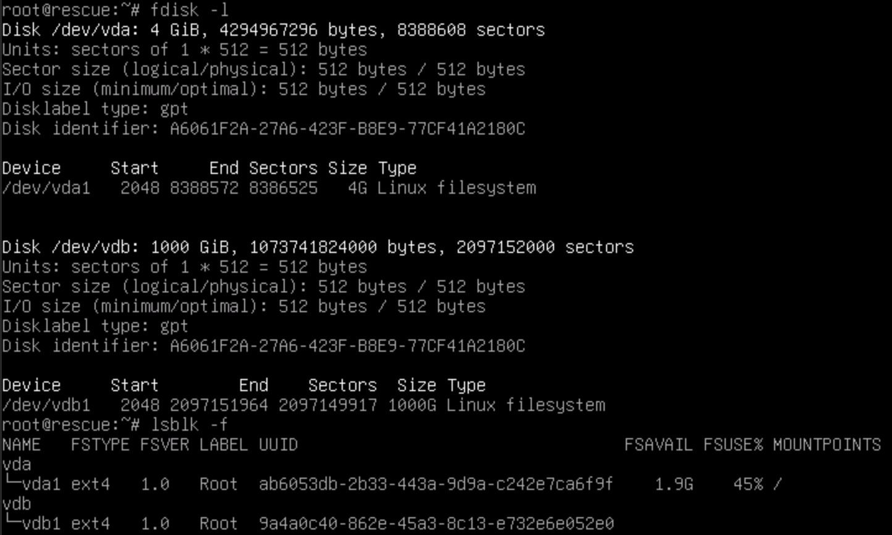

备注：安装完成之后，第一时间安装 timeshift 进行备份，后续操作中出现任何失误都可以通过 timeshift 来选择性的恢复到中间状态，避免出错后需要重新安装。

具体操作参考：

https://skyao.net/learning-ubuntu-server/docs/installation/timeshift/

## 安装

先 su 到 root，再进行安装：

```bash
su root
apt install timeshift
```

## 配置

找到 timeshift 分区的 UUID：

```bash
lsblk -f
```

例如这个机器有三块硬盘， `/var/timeshift` 所在的分区 UUDI 为 `3c5ad47e-4318-4797-8342-7e602ac524d2` ：

```bash
$ lsblk -f
NAME        FSTYPE FSVER LABEL UUID                                 FSAVAIL FSUSE% MOUNTPOINTS
nvme1n1                                                                            
`-nvme1n1p1 ext4   1.0         ccae6bf3-d4cd-422d-b67a-b5b8dfe83fc6  782.2G     0% /var/data2
nvme0n1                                                                            
`-nvme0n1p1 ext4   1.0         eff3a45e-be5e-4f5e-a969-0998a8a10e33  782.2G     0% /var/data
nvme2n1                                                                            
|-nvme2n1p1 vfat   FAT32       C4B5-2470                             505.1M     1% /boot/efi
|-nvme2n1p2 ext4   1.0         41949492-a351-4770-80f6-d4c7dc5b23bc  171.2G     1% /
`-nvme2n1p3 ext4   1.0         3c5ad47e-4318-4797-8342-7e602ac524d2     48G     0% /var/timeshift
```

然后设置 backup_device_uuid ，注意 timeshift 在第一次使用时会读取 default.json 文件：

```bash
vi /etc/timeshift/default.json
```

验证一下：

```bash
timeshift --list
```

这个时候还没有进行备份，没有 snapshot：

```bash
timeshift --list
First run mode (config file not found)
Selected default snapshot type: RSYNC
Mounted '/dev/nvme2n1p3' at '/run/timeshift/3424/backup'
Device : /dev/nvme2n1p3
UUID   : 3c5ad47e-4318-4797-8342-7e602ac524d2
Path   : /run/timeshift/3424/backup
Mode   : RSYNC
Status : No snapshots on this device
First snapshot requires: 0 B

No snapshots found
```

此时会自动创建配置文件 `/etc/timeshift/timeshift.json`，后续修改配置就要修改这个文件。

### 配置 excludes

除了基本的 backup_device_uuid 外，还需要配置 excludes 以排除不需要 timeshift 进行备份的内容。

```json
{
  "backup_device_uuid" : "3c5ad47e-4318-4797-8342-7e602ac524d2",
  ......
  "exclude" : [
    "/root/**",
    "/home/**",
    "/timeshift/**",
    "/var/data/**",
    "/var/data2/**",
    "/var/data3/**"
  ],
  ......
}
```

需要排除的内容通常包括用户目录（`/root/`和 `/home/`），以及资料存储如我这里的 `"/var/data/` 等几块用来存储的硬盘，以及 timeshift 自身所在目录 `/timeshift/` （取决于安装debian时选择的timeshift分区的挂载路径）。

### 配置自动备份

设置每天/每周/每月的自动备份：

```json
{
  ......
  "schedule_monthly" : "true",
  "schedule_weekly" : "true",
  "schedule_daily" : "true",
  ......
  "count_monthly" : "2",
  "count_weekly" : "3",
  "count_daily" : "5",
  ......
}
```

## 创建快照

先不做任何操作，在操作系统安装完成之后，第一时间进行备份：

```bash
timeshift --create --comments "first backup after install"
```

第一次备份大概要消耗2.3g的存储空间。

## 补充:调整分区大小

有时候,某些 debian 操作系统,比如一些 vps 网站,他们提供的 debian 操作系统,是直接把整个硬盘作为一个分区安装 debian 操作系统的. 没有机会在 debian 安装前预留 timeshift 的分区.

因此就必须在操作系统安装之后,再进行磁盘空间的调整,缩小操作系统所在分区的大小,腾出空间来做 timeshift 的备份分区.

具体操作步骤:

1. 开启 Rescue Mode

   用 debian 自带的急救系统(Rescue Mode)启动, 这样操作系统安装的磁盘就不会被挂载,绕开磁盘被挂载之后无法操作的问题.

   这是正常启动时的磁盘情况, 1t 的硬盘空间都被划分为 `/dev/vda1`:

   ```bash
   $ fdisk -l

    Disk /dev/vda: 1000 GiB, 1073741824000 bytes, 2097152000 sectors
    Units: sectors of 1 * 512 = 512 bytes
    Sector size (logical/physical): 512 bytes / 512 bytes
    I/O size (minimum/optimal): 512 bytes / 512 bytes
    Disklabel type: gpt
    Disk identifier: A6061F2A-27A6-423F-B8E9-77CF41A2180C

    Device     Start        End    Sectors  Size Type
    /dev/vda1   2048 2097151964 2097149917 1000G Linux filesystem

   $ lsblk -f
    NAME   FSTYPE FSVER LABEL UUID                                 FSAVAIL FSUSE% MOUNTPOINTS
    vda                                                                           
    `-vda1 ext4   1.0   Root  9a4a0c40-862e-45a3-8c13-e732e6e052e0  932.9G     0% /
   ```

   这是 Rescue Mode 启动之后的磁盘情况, 此时操作系统是在一个内存模拟磁盘上启动的,而之前的 1t 磁盘没有被挂载. 这就方便操作了.

   

2. 检查磁盘: 

   操作之前必须先执行fsck 命令检查磁盘,如果有问题要先修复:

   ```bash
   e2fsck -f /dev/vdb1
   ```

   

3. 调整文件系统大小

   这是压缩文件系统,也就是把所有的文件都调整到这个空间范围内,这样后面缩小分区大小时就不会丢失数据. 比如我这里计划只给操作系统留50g空间.

   ```bash
   resize2fs /dev/vdb1 50G
   ```

   

4. 调整分区大小

   这次是真实的开始调整操作系统所在分区的大小了.

   ```bash
   cfdisk /dev/vdb
   ```

   在上面选择分区:

   

   在下面的命令中选择 "Resize":

   

   输入新的大小,如 50G:

   

   移动到 Write,写入修改. 这是改动完成的磁盘情况:

   

5. 退出 Rescue Mode, 正常启动

6. 用 fdisk 对剩余空间进行分区, 设定一个分区为 timeshift 分区即可.

   ```bash
    $ fdisk -l
    Disk /dev/vda: 1000 GiB, 1073741824000 bytes, 2097152000 sectors
    Units: sectors of 1 * 512 = 512 bytes
    Sector size (logical/physical): 512 bytes / 512 bytes
    I/O size (minimum/optimal): 512 bytes / 512 bytes
    Disklabel type: gpt
    Disk identifier: A6061F2A-27A6-423F-B8E9-77CF41A2180C

    Device          Start        End    Sectors  Size Type
    /dev/vda1        2048  104859647  104857600   50G Linux filesystem
    /dev/vda2   104859648 1992296447 1887436800  900G Linux filesystem
    /dev/vda3  1992296448 2097149951  104853504   50G Linux filesystem
    $ $lsblk -f
    NAME   FSTYPE FSVER LABEL UUID                                 FSAVAIL FSUSE% MOUNTPOINTS
    vda                                                                           
    |-vda1 ext4   1.0   Root  9a4a0c40-862e-45a3-8c13-e732e6e052e0   45.3G     3% /
    |-vda2 ext4   1.0         038772c5-edd8-400b-932f-902821b0350b                
    `-vda3 ext4   1.0         b1a8967b-4f64-419e-a0d8-ac1cda3ea5f6
   ```