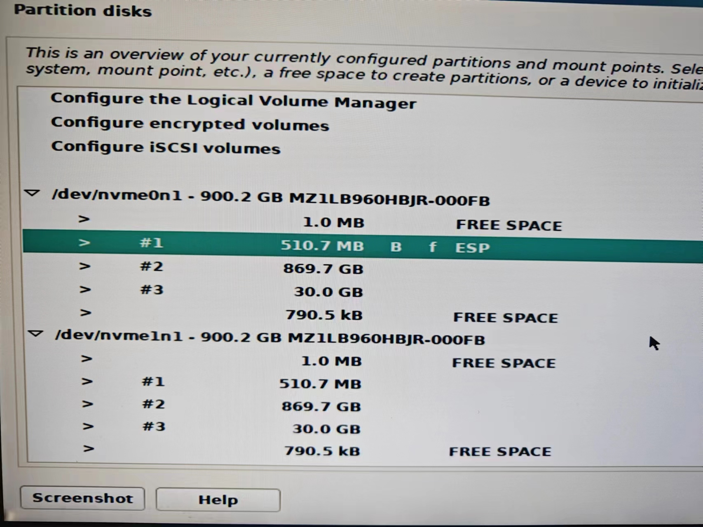
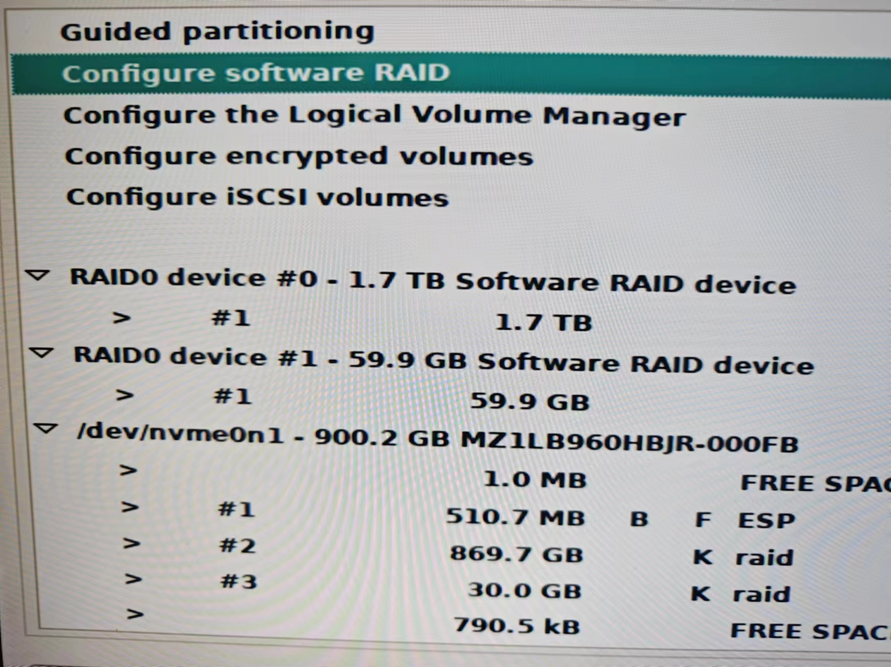
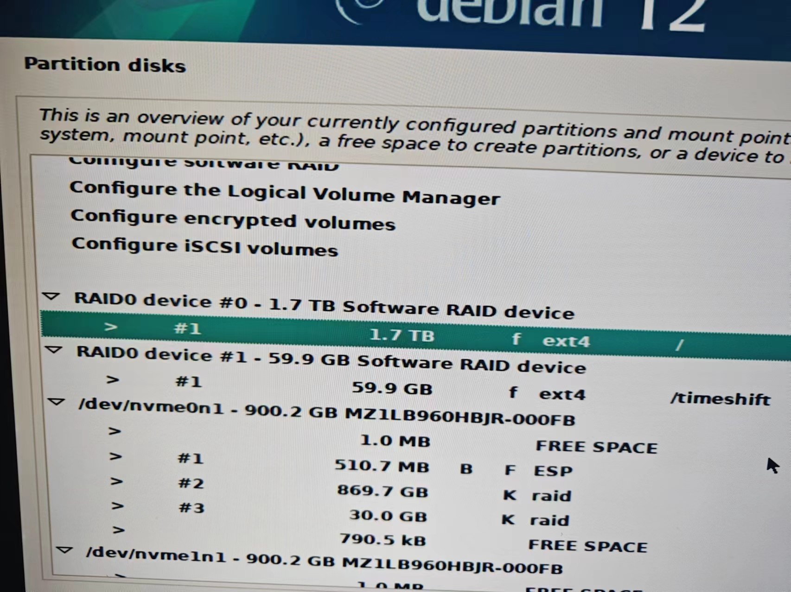

先准备好两块硬盘，重新分区，并保持两个硬盘的分区方案一致。

第一块硬盘，先后分区为：

- 512 MB: 分区选择 "EFI System Partition"
- 剩余空间-30g：分区选择不使用该分区（use as:"do not use"），准备 raid 后给 "/" 用
- 30g：分区选择不使用该分区（use as:"do not use"），准备 raid 后给 "/timeshift" 用

第二块硬盘和第一块硬盘保持一致，先后分区为：

- 512 MB: 分区选择不使用该分区（use as:"do not use"）
- 剩余空间-30g：分区选择不使用该分区（use as:"do not use"），准备 raid 后给 "/" 用
- 30g：分区选择不使用该分区（use as:"do not use"），准备 raid 后给 "/timeshift" 用

然后选择  "Configure software RAID"， 将两块大的分区和两块小的分区分别创建 raid0 。

这样就得到两个 raid0 device，大小分别为 1.7t 和 60g。

分别格式化为 ext4，挂载为  "/"  和 "/timeshift" 。

然后正常安装 debian12。

