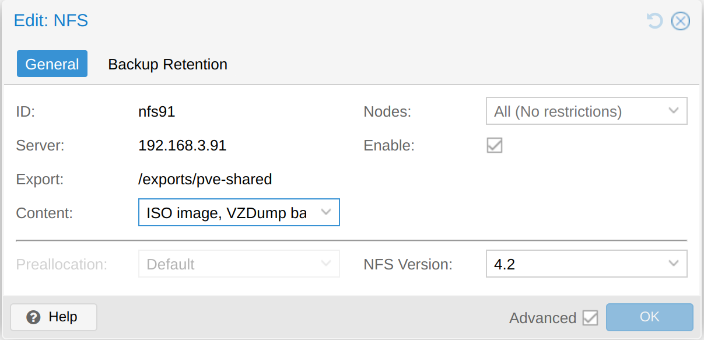

## 构想

devserver91 开发服务器上，需要搭建一个 nfs 服务器，给 pve 和其他方式使用。

## 准备工作

### 准备虚拟机

基于 template-debian12-dev 的虚拟机上搭建。

### 硬盘直通

在开启 pve 直通的基础上，将两块三星 pm983a 900g 的 ssd 硬盘直通到 devserver91 虚拟机中。

能看到这块 ssd 硬盘：

```bash
$ lspci | grep Non-Volatile

01:00.0 Non-Volatile memory controller: Samsung Electronics Co Ltd NVMe SSD Controller SM981/PM981/PM983
02:00.0 Non-Volatile memory controller: Samsung Electronics Co Ltd NVMe SSD Controller SM981/PM981/PM983
```

因为硬盘没有分区，所以看起来是这样：

```bash
$ lsblk 
NAME    MAJ:MIN RM   SIZE RO TYPE MOUNTPOINTS
sda       8:0    0   512G  0 disk 
├─sda1    8:1    0   512M  0 part /boot/efi
├─sda2    8:2    0 465.7G  0 part /
└─sda3    8:3    0  45.8G  0 part /timeshift
nvme0n1 259:0    0 838.4G  0 disk 
nvme1n1 259:1    0 838.4G  0 disk 
```

sda 是虚拟机的磁盘，虚拟了 512g。

nvme0n1 和 nvme1n1 是直通进来的 ssd 硬盘，900G 大小但实际可用大小为 838G。

### 硬盘分区

```bash
sudo fdisk /dev/nvme0n1
```

g 转为 GPT partition table
p 打印分区表
n 创建新分区，这里就只创建一个900g的大分区给 nas 用。

分区完成后查看这块硬盘的情况：

```bash
sudo fdisk -l
Disk /dev/nvme0n1: 838.36 GiB, 900185481216 bytes, 219771846 sectors
Disk model: MZ1LB960HBJR-000FB                      
Units: sectors of 1 * 4096 = 4096 bytes
Sector size (logical/physical): 4096 bytes / 4096 bytes
I/O size (minimum/optimal): 131072 bytes / 131072 bytes
Disklabel type: gpt
Disk identifier: 5BA21D3B-9403-0B4B-9399-E72086BE6F46

Device         Start       End   Sectors   Size Type
/dev/nvme0n1p1   256 219771647 219771392 838.4G Linux filesystem


Disk /dev/nvme1n1: 838.36 GiB, 900185481216 bytes, 219771846 sectors
Disk model: MZ1LB960HBJR-000FB                      
Units: sectors of 1 * 4096 = 4096 bytes
Sector size (logical/physical): 4096 bytes / 4096 bytes
I/O size (minimum/optimal): 131072 bytes / 131072 bytes
Disklabel type: gpt
Disk identifier: 39AFF853-D9C1-7841-93CB-83DD3A83C7F0

Device         Start       End   Sectors   Size Type
/dev/nvme1n1p1   256 219771647 219771392 838.4G Linux filesystem


Disk /dev/sda: 512 GiB, 549755813888 bytes, 1073741824 sectors
Disk model: QEMU HARDDISK   
Units: sectors of 1 * 512 = 512 bytes
Sector size (logical/physical): 512 bytes / 512 bytes
I/O size (minimum/optimal): 512 bytes / 512 bytes
Disklabel type: gpt
Disk identifier: 784AC8F8-8E2A-4A0D-A9AD-D3056175791B

Device         Start        End   Sectors   Size Type
/dev/sda1       2048    1050623   1048576   512M EFI System
/dev/sda2    1050624  977612799 976562176 465.7G Linux filesystem
/dev/sda3  977612800 1073739775  96126976  45.8G Linux filesystem
```

### 硬盘格式化

将硬盘格式化为 ext4 文件系统：

```bash
sudo mkfs.ext4 /dev/nvme0n1p1
sudo mkfs.ext4 /dev/nvme1n1p1
```

### 挂载分区

查看 ssd 分区的 uuid：

```bash
$ sudo lsblk -f
              
NAME FSTYPE FSVER LABEL UUID                                 FSAVAIL FSUSE% MOUNTPOINTS
sda                                                                         
├─sda1
│    vfat   FAT32       BE75-FC62                             505.1M     1% /boot/efi
├─sda2
│    ext4   1.0         81fdaf25-6712-48ee-bb53-1c4a78c8ef9f    429G     1% /
└─sda3
     ext4   1.0         4b922cfb-2123-48ce-b9fe-635e73fb6aa8   37.7G    11% /timeshift
nvme0n1                                                                     
└─nvme0n1p1                                                                    
nvme1n1
└─nvme1n1p1
```

执行

```bash
sudo vi /etc/fstab
```

查看目前现有的三个分区的挂载情况：

```bash
# <file system> <mount point>   <type>  <options>       <dump>  <pass>
# / was on /dev/sda2 during installation
UUID=81fdaf25-6712-48ee-bb53-1c4a78c8ef9f /               ext4    errors=remount-ro 0       1
# /boot/efi was on /dev/sda1 during installation
UUID=BE75-FC62  /boot/efi       vfat    umask=0077      0       1
# /timeshift was on /dev/sda3 during installation
UUID=4b922cfb-2123-48ce-b9fe-635e73fb6aa8 /timeshift      ext4    defaults        0       2
/dev/sr0        /media/cdrom0   udf,iso9660 user,noauto     0       0
```

增加两块 ssd 硬盘的挂载，挂载到 "/mnt/data" 和 "/mnt/app"：

```bash
# data storage was on /dev/nvme0n1p1(960g)
UUID=be0b8bd0-edf1-49c2-b08d-dfc2d064c5ee /mnt/data      ext4    defaults        0       2

# app storage was on /dev/nvme1n1p1(960g)
UUID=64e00394-bc95-4ca6-996d-7827f77e3a0d /mnt/app      ext4    defaults        0       2
```

重启机器。再看一下分区挂载情况：

```bash
$ sudo lsblk -f

NAME        FSTYPE FSVER LABEL UUID                                 FSAVAIL FSUSE% MOUNTPOINTS
sda                                                                                
├─sda1      vfat   FAT32       BE75-FC62                             505.1M     1% /boot/efi
├─sda2      ext4   1.0         81fdaf25-6712-48ee-bb53-1c4a78c8ef9f    429G     1% /
└─sda3      ext4   1.0         4b922cfb-2123-48ce-b9fe-635e73fb6aa8   37.6G    11% /timeshift
nvme1n1                                                                            
└─nvme1n1p1 ext4   1.0         64e00394-bc95-4ca6-996d-7827f77e3a0d  782.2G     0% /mnt/app
nvme0n1                                                                            
└─nvme0n1p1 ext4   1.0         be0b8bd0-edf1-49c2-b08d-dfc2d064c5ee  782.1G     0% /mnt/data
```

### 准备共享目录

为了方便后续的管理，采用伪文件系统:

```bash
cd /mnt/data 

sudo mkdir shared
sudo mkdir pve-shared

sudo chown -R nobody:nogroup /mnt/data/shared
sudo chown -R nobody:nogroup /mnt/data/pve-shared
```

创建 export 目录：

```bash
sudo mkdir -p /exports/{shared,pve-shared}

sudo chown -R nobody:nogroup /exports
```

修改 `/etc/fstab` 文件来 mount 伪文件系统和 exports

```bash
sudo vi /etc/fstab
```

增加如下内容:

```bash
# nfs exports
/mnt/data/shared /exports/shared     none bind
/mnt/data/pve-shared /exports/pve-shared    none bind
```

重启。

## 搭建 nas

### 安装 nfs server

```bash
# 安装
sudo apt install nfs-kernel-server -y

# 开机自启
sudo systemctl start nfs-kernel-server
sudo systemctl enable nfs-kernel-server

# 验证
sudo systemctl status nfs-kernel-server
Jan 29 20:40:15 skynas3 systemd[1]: Starting nfs-server.service - NFS server and services...
Jan 29 20:40:15 skynas3 exportfs[1422]: exportfs: can't open /etc/exports for reading
Jan 29 20:40:16 skynas3 systemd[1]: Finished nfs-server.service - NFS server and services.
```

### 配置 nfs v4

修改 nfs-kernel-server 的配置：

```bash
sudo vi /etc/default/nfs-kernel-server
```

修改内容:

```bash
# 这行新增
RPCNFSDOPTS="-N 2 -N 3"
# 这行已经存在，修改内容
RPCMOUNTDOPTS="--manage-gids -N 2 -N 3"
# 其他不动

#修改或添加以下行：
RPCNFSDOPTS="--nfs-version 4"
```

配置 NFSv4 根目录， 

```bash
sudo vi /etc/idmapd.conf
```

确保有以下配置：

```properties
[General]
Domain = yourdomain.com  # 替换为你的域名或保留默认

[Translation]
Method = nsswitch
```

重启 nfs server

```bash
sudo systemctl restart nfs-kernel-server
sudo systemctl enable nfs-kernel-server
```


验证 NFS 版本:

```bash
sudo cat /proc/fs/nfsd/versions
+3 +4 +4.1 +4.2
```

备注： 按说应该没有 +3, 即不支持 nfs v3, 但是没有设置出来。


### 配置 nfs export

```bash
sudo vi /etc/exports
```

修改 nfs exports 的内容，这里我们 export shared/pve-shared 目录：

```bash
/exports/shared   192.168.0.0/16(rw,sync,no_subtree_check,no_root_squash)
/exports/pve-shared   192.168.0.0/16(rw,sync,no_subtree_check,no_root_squash)
```

重启 nfs-kernel-server，查看 nfs-kernel-server 的状态：

```bash
sudo systemctl restart nfs-kernel-server
sudo systemctl status nfs-kernel-server
```

输出为：

```bash
nfs-server.service - NFS server and services
     Loaded: loaded (/lib/systemd/system/nfs-server.service; enabled; preset: enabled)
    Drop-In: /run/systemd/generator/nfs-server.service.d
             └─order-with-mounts.conf
     Active: active (exited) since Wed 2024-03-20 23:09:19 EDT; 17ms ago
    Process: 863 ExecStartPre=/usr/sbin/exportfs -r (code=exited, status=0/SUCCESS)
    Process: 864 ExecStart=/usr/sbin/rpc.nfsd (code=exited, status=0/SUCCESS)
   Main PID: 864 (code=exited, status=0/SUCCESS)
        CPU: 7ms

Mar 20 23:09:19 skynas3 systemd[1]: Starting nfs-server.service - NFS server and services...
Mar 20 23:09:19 skynas3 systemd[1]: Finished nfs-server.service - NFS server and services.
```

验证：

```bash
ps -ef | grep nfs
```

输出为：

```
ps -ef | grep nfs
root         714       1  0 23:04 ?        00:00:00 /usr/sbin/nfsdcld
root         866       2  0 23:09 ?        00:00:00 [nfsd]
root         867       2  0 23:09 ?        00:00:00 [nfsd]
root         868       2  0 23:09 ?        00:00:00 [nfsd]
root         869       2  0 23:09 ?        00:00:00 [nfsd]
root         870       2  0 23:09 ?        00:00:00 [nfsd]
root         871       2  0 23:09 ?        00:00:00 [nfsd]
root         872       2  0 23:09 ?        00:00:00 [nfsd]
root         873       2  0 23:09 ?        00:00:00 [nfsd]
```

查看当前挂载情况：

```bash
$ sudo showmount -e
Export list for devserver91:
/exports/pve-shared 192.168.0.0/16
/exports/shared     192.168.0.0/16
```

## nfs客户端

- https://www.howtoforge.com/tutorial/install-nfs-server-and-client-on-debian/： 主要参考这个文档的做法

安装 nfs client：

```bash
sudo apt install nfs-common
```

准备目录:

```bash
sudo mkdir /mnt/shared91
```

```bash
sudo mount -t nfs4 192.168.3.91:/exports/shared /mnt/shared91
```

这样就能手工将远程 `/exports/shared` 目录挂载到本地目录。

暂时不采用开机自动挂载的方式，避免减缓开机的速度，增加鼓掌概率，需要 mount 时手工挂载就是。

方便起见，准备一个 mount_shared91 脚本：

```bash
sudo vi /mnt/mount_shared91.zsh
```

内容为：

```zsh
#!/usr/bin/env zsh

# 定义变量
NFS_SERVER="192.168.3.91"
NFS_EXPORT="/exports/shared"
MOUNT_POINT="/mnt/shared91"

# 检查挂载点是否存在，不存在则创建
if [[ ! -d "$MOUNT_POINT" ]]; then
    echo "创建挂载点目录: $MOUNT_POINT"
    sudo mkdir -p "$MOUNT_POINT"
    sudo chown "$USER:$USER" "$MOUNT_POINT"  # 可选：设置当前用户为所有者
fi

# 检查是否已挂载
if mount | grep -q "$MOUNT_POINT"; then
    echo "⚠️  $MOUNT_POINT 已经挂载"
else
    echo "正在挂载 NFS: $NFS_SERVER:$NFS_EXPORT → $MOUNT_POINT"
    sudo mount -t nfs4 "$NFS_SERVER:$NFS_EXPORT" "$MOUNT_POINT"
    
    # 检查挂载是否成功
    if [[ $? -eq 0 ]]; then
        echo "✅ 挂载成功"
        df -h | grep "$MOUNT_POINT"  # 显示磁盘使用情况
    else
        echo "❌ 挂载失败，请检查:"
        echo "1. NFS 服务器是否在线？"
        echo "2. 客户端是否安装 nfs-common？ (sudo apt install nfs-common)"
        echo "3. 防火墙是否放行 NFS 端口？"
    fi
fi
```

再准备一个 unmount_shared91 脚本：

```bash
sudo vi /mnt/unmount_shared91.zsh
```

内容为：

```zsh
#!/usr/bin/env zsh

# 定义变量
NFS_SERVER="192.168.3.91"
NFS_EXPORT="/exports/shared"
MOUNT_POINT="/mnt/shared91"

if mount | grep -q "$MOUNT_POINT"; then
     sudo umount -l "$MOUNT_POINT"
     echo "✅ 已卸载 $MOUNT_POINT"
else
     echo "⚠️  $MOUNT_POINT 未挂载"
fi
```

增加可执行权限:

```bash
sudo chmod +x /mnt/mount_shared91.zsh
sudo chmod +x /mnt/unmount_shared91.zsh
```

之后只要执行相应的命令就可以手工挂载和卸载 nfs shared 目录。

## pve nfs storage

在 pve 下，点击 “datacenter” -> “storage” -> “Add”



完成这个设置之后，该集群内的任何一台机器上，都会出现一个 `/mnt/pve/nfs91` 目录，mount 到 上面的 nfs exports。之后就可以通过这个目录像访问本地文件夹一样访问nfs。

## 参考资料

- https://www.linuxtechi.com/how-to-install-nfs-server-on-debian/
- https://www.howtoforge.com/tutorial/install-nfs-server-and-client-on-debian/
- https://www.server-world.info/en/note?os=Debian_12&p=nfs&f=1